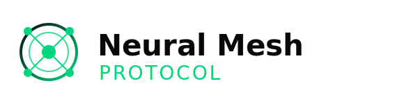

  <picture>
    <source media="(prefers-color-scheme: dark)" srcset="./docs/logo/dark.svg">
    
  </picture>

# NMP: Neural Mesh Protocol (v1.0-alpha)

NMP (Neural Mesh Protocol) is a next-generation, high-performance binary transport mesh designed for advanced Artificial Intelligence Agent communication. Conceived as a conceptual and technical evolution of existing context protocols (like MCP), NMP radically shifts the paradigm from pulling massive data towards secure **Logic-on-Origin** execution.

## Vision

In the rapid evolution of autonomous agents, transferring gigabytes of raw data to central AI nodes for filtering, parsing, or reasoning is increasingly inefficient, slow, and expensive.

NMP introduces a decentralized, Zero-Trust architectural model where AI agents inject ultra-lightweight, sandboxed execution modules (WebAssembly) directly into the data source. By moving the logic to the data rather than the data to the logic, NMP aims to:

- **Dramatically reduce network latency and bandwidth consumption.**
- **Save millions of tokens** by returning only semantically relevant, cryptographically verified evidence from the origin.
- **Provide Zero-Trust security** natively, ensuring the host is never exposed to arbitrary or unsandboxed agent execution via strict WASI capabilities.

## Architecture

The project is divided into two distinct, highly isolated modules:

### 1. The Rust Application (`rust-app/`)
The underlying high-performance mesh network, node infrastructure, DHT Kademlia discovery, and the Wasmtime (WASI) sandboxing environment. This is where the core nodes (Client/Agent and Server/Data Source) operate on the metal.
👉 [Read the Rust App Documentation](./rust-app/README.md)

### 2. The TypeScript SDK (`typescript-sdk/`)
The developer tooling, designed to act as a direct, Zero-Friction drop-in replacement for the current Model Context Protocol (MCP) APIs. It provides interfaces like `NmpServer` and `NmpClient`, Zod validation schemas, and transparent Javy/WASM compilation to connect Node.js environments to the Neural Mesh.
👉 [Read the TypeScript SDK Documentation](./typescript-sdk/README.md)

## Key Technical Pillars

1. **Push-Logic Paradigm:** Execute WASM logic exactly where the data lives.
2. **High-Performance Binary Transport:** Built on Tonic (gRPC) and Protobuf instead of JSON over stdout.
3. **Zero-Trust Sandboxing:** Powered by Wasmtime and WASI Preview 1.
4. **Decentralized Mesh Topology:** Peer-to-peer agent discovery via libp2p.
5. **Persistent Multiplexing:** QUIC transport.

---
*Developed as the next evolution in Agentic Data Context.*
