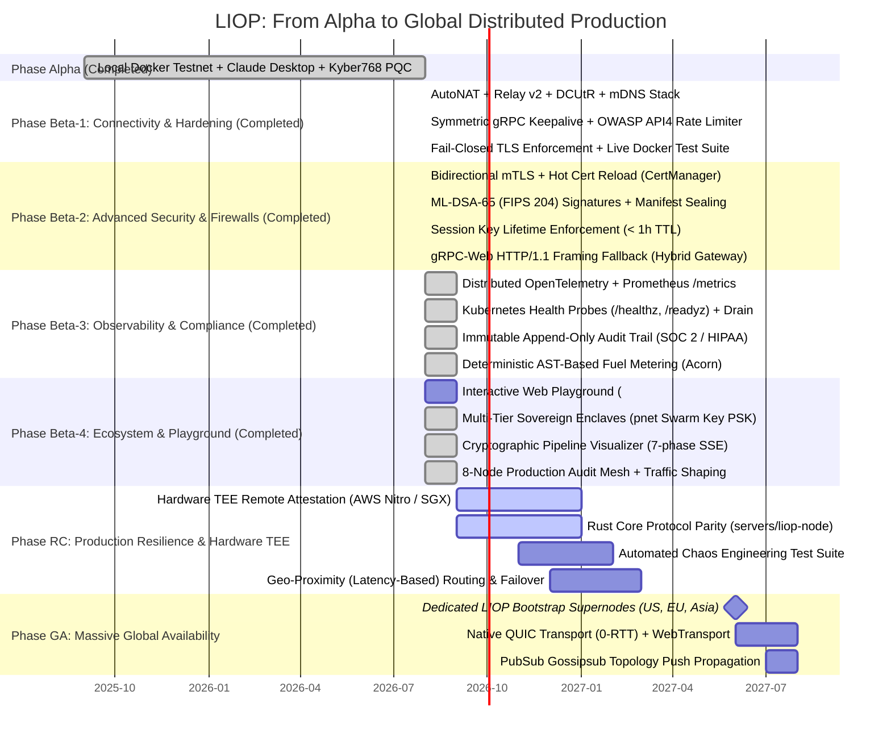

# 🌐 LIOP Global Distributed Mesh Deployment Roadmap

This document serves as the permanent, authoritative blueprint for transitioning the Logic-Injection-on-Origin Protocol (LIOP) from a local Docker testnet into an autonomous, globally distributed zero-trust mesh protocol operating across corporate networks, firewalls, and diverse geographic regions.

---

## 🗺️ Evolution Roadmap Overview

---

## ✅ 1. Completed Phases (Verified & Production-Tested)

### 1.1 Phase Alpha (Core Architecture & Zero-Trust Sandbox)
* **Status**: Complete & Verified.
* **Core Runtime**: V8 Isolate sandboxing with 25 poisoned globals, deep-frozen prototypes (11 core prototypes), and a 32KB AST Taint Analyzer (Information Flow Control) to prevent PII derivation and side channels.
* **Cryptography**: Post-Quantum ML-KEM-768 (`mlkem@2.7.0`, NIST FIPS 203) key encapsulation for gRPC intent handshakes, AES-256-GCM authenticated payload encryption, and HMAC-SHA256 ZK-Receipts binding output to logic and SOX-compliant dataset hashes.
* **Differential Privacy**: Laplace mechanism with CSPRNG (`crypto.randomBytes()`) and a 3-tier query budget (`FORBIDDEN`, `SENSITIVE`, `PUBLIC`) aligned with NIST SP 800-226.
* **Dual-Era MCP Bridge**: Seamless protocol transcoding supporting both MCP v2 (2026-07-28) and v1 legacy (2025-11-25) clients.

### 1.2 Phase Beta-1: Global Network Connectivity & Firewall Resilience
* **Status**: Complete & Verified against live 4-node Docker mesh (`nexus`, `bank`, `vault`, `oracle`).
* **P2P NAT Traversal Stack**:
  - `@libp2p/autonat`: Autonomous node reachability detection.
  - `@libp2p/circuit-relay-v2`: Client transport (`circuitRelayTransport`) and rate-limited relay reservation server (`circuitRelayServer`).
  - `@libp2p/dcutr`: Decentralized Hole Punching protocol for direct point-to-point connections through NATs.
  - `@libp2p/mdns`: Zero-configuration local area network (LAN) peer discovery.
* **Symmetric gRPC Keepalive (NIST SP 800-207)**:
  - Created `src/rpc/channel-options.ts` implementing `keepalive_time_ms: 30000`, `keepalive_timeout_ms: 10000`, and `permit_without_calls: 1`.
  - Applied symmetrically across client, server, and router to prevent silent NAT gateway timeouts.
* **Rate Limiting & DoS Defense (OWASP API4:2023)**:
  - Created `src/gateway/rate-limiter.ts` using an O(1) sliding window token bucket algorithm with periodic purge.
  - Integrated into `src/gateway/hybrid.ts` protecting `POST /mcp` with HTTP 429 (`Too Many Requests`) and `Retry-After` headers.
* **Fail-Closed TLS Hardening (`LIOP_ENFORCE_TLS`)**:
  - Configured `src/rpc/tls.ts` to abort execution when `NODE_ENV=production` or `LIOP_ENFORCE_TLS=true` if certificates are missing, eliminating silent plaintext fallback.
* **Multiaddr-Driven Docker Routing**:
  - Implemented autonomous port detection in `router.ts` (`isDockerPort`), dynamically mapping internal container endpoints to published host ports (`13011`/`13021`/`13031`) without depending on sanitized client environment variables.

### 1.3 Phase Beta-2: Advanced Security, P2P Post-Quantum & Firewalls
* **Status**: Complete & Verified.
* **Post-Quantum Digital Signatures (ML-DSA-65 / NIST FIPS 204)**:
  - Implemented `src/rpc/crypto/dilithium.ts` providing quantum-resistant digital signatures using `@noble/post-quantum`.
  - Canonical JSON serialization for tamper-proof manifest sealing (`signManifest` / `verifyManifest`) and node revocation.
  - Test suite `src/rpc/crypto/dilithium.test.ts`: **9/9 tests passing**.
* **Strict Session Key Lifetime Enforcement (NIST SP 800-53 / PCI-DSS)**:
  - Enforced a hard 1-hour TTL (3600 seconds) ceiling on all PQC session secrets agreed via ML-KEM-768.
  - Validated in `src/workers/logic-execution.ts` and `src/server/index.ts`. Rejects expired sessions with `[LIOP-PQC] Session secret expired` and blocks future timestamp tampering.
  - Test suite `tests/unit/security/session-lifetime.test.ts`: **3/3 tests passing**.
* **Bidirectional mTLS with Hot-Reloading (`CertManager`)**:
  - Created `src/security/cert-manager.ts` featuring X.509 validity inspection, automated expiration warning alerts, and filesystem watchers (`fs.watch`) for non-disruptive hot certificate reloading.
  - Updated `src/rpc/tls.ts` to enforce client certificate authentication (`checkClientCertificate: true`) when `mutualTls: true` and fail-closed unconditionally if root CA is missing.
  - Test suite `tests/unit/security/cert-manager.test.ts`: **5/5 tests passing**.
* **gRPC-Web HTTP/1.1 Framing Fallback**:
  - Created `src/gateway/grpc-web.ts` implementing the official gRPC-Web framing standard (5-byte prefix with data 0x00 / trailers 0x80 flags).
  - Integrated into `src/gateway/hybrid.ts` (`setupH1Routes`) enabling browsers, Layer 7 corporate proxies, and strict enterprise WAFs to invoke LIOP nodes over HTTP/1.1.
  - Test suite `tests/unit/gateway/grpc-web.test.ts`: **5/5 tests passing**.
* **Verification Evidence**:
  - SDK global test suite: **64/64 test files passing, 464/464 tests green (100%)**.
  - BiomeJS compliance: **103 files verified, 0 errors, 0 warnings (`Exit code 0`)**.
  - Build verification: **ESM bundle in 950ms, DTS bundle in 13.5s (`Exit code 0`)**.

---

## ⏳ 2. Upcoming Phases (Detailed Specifications)

### 1.4 Phase Beta-3: Enterprise Observability & Compliance (SOC 2 / HIPAA)
* **Status**: Complete & Verified.
* **Kubernetes Health & Liveness Probes**:
  - Implemented `/healthz` and `/readyz` endpoints in `LiopHybridGateway` with DHT status inspection.
  - Implemented graceful draining (`gateway.drain(5000)`) in `src/gateway/hybrid.ts` and `src/rpc/server.ts`.
* **Prometheus Metrics Endpoint (`GET /metrics`)**:
  - Real-time scrape-handler refreshing `liop_mesh_peers_connected`, `liop_tool_calls_total`, and `liop_fuel_consumed`.
* **Distributed OpenTelemetry Integration**:
  - Bound to `gen_ai.client.token.usage` and `gen_ai.client.operation.duration` via `LiopOTelBridge`.
* **Immutable Audit Trail for SOC 2 Type II & HIPAA**:
  - Cryptographically verifiable Hash-Chain in `AuditLogger` with append-only integrity checking and tamper flags.
* **Deterministic AST-Based Fuel Metering & Side-Channel Invariance (NIST SP 800-53)**:
  - Implemented `calculateAstInstructionFuel` with 100-bucket quantization ensuring `stddev = 0` across heterogeneous secret payloads.

### 1.5 Phase Beta-4: Developer Ecosystem, Interactive Web Playground & Multi-Tier Production Audit
* **Status**: Complete & Verified against 8-node Docker topology.
* **Interactive Web Playground (`:16000` / `:14000`)**:
  - Real-time 7-phase SSE execution stream (`http://localhost:16000`).
  - Tri-tab results panel: `Aggregated Output`, `Fuel & Telemetry`, and `Crypto Proofs`.
  - Dual high-contrast theme engine (Obsidian OLED `#000000` vs Slate Navy `#0f172a`) with atomic DOM switching.
  - Live token economy dashboard demonstrating **98.9% - 99.6% token reduction** compared to traditional MCP.
  - REST telemetry endpoint at `GET /api/telemetry` for aggregated session tracking.
* **Multi-Tier Sovereign Enclaves (`pnet` Swarm Key PSK)**:
  - Physical socket shielding on Tier 1 subnets (`The Bank`, `The Vault`) using 256-bit PSK (`/key/swarm/psk/1.0.0/`).
  - Border LIO Gateway (`blg`) perimeter enforcement with RFC 6749 OAuth 2.1 client credentials against Nexus OIDC.
* **Production Audit Automation (10 Suites, 00 to 09)**:
  - Validated with Linux `tc netem` traffic shaping across LAN, transoceanic, and hostile 3G profiles.
  - Automated CLI scripts: `pnpm run audit:prod:start`, `audit:prod:run`, `audit:prod:clean`.

---

## ⏳ 2. Upcoming Phases (Detailed Specifications)

### 🔵 Phase RC: Production Resilience, Hardware TEE & Rust Core Parity
* **Target Window**: Q4 2026 - Q1 2027
* **Key Components**:
  1. **Rust Core Protocol Parity (`servers/liop-node`)**:
     - Port multi-tier enclaves (`pnet` Swarm Key PSK) to `libp2p-pnet` in Rust.
     - Implement Dual-Era MCP v2 / v1 handshake in Rust gateway.
     - Symmetrical Tonic gRPC keepalive channel options.
  2. **Hardware TEE Remote Attestation (AWS Nitro Enclaves / Intel SGX)**:
     - Replace simulation stubs in `crypto/verifier.ts` (`verifyTeeAttestation()`) with cryptographic verification of signed AWS Nitro attestation documents.
     - *Dependencies*: `pnpm add @aws-sdk/client-nitro-enclaves-attestation`.
     - *Target Files*: `src/crypto/verifier.ts`, `servers/liop-node/src/tee.rs`.
  3. **Automated Chaos Engineering Suite**:
     - Automated test suite verifying mesh behavior under simulated transcontinental WAN latency (300ms), packet loss, partition splits, and abrupt bootstrap node termination.
     - *Target Files*: `tests/chaos/network-partition.test.ts`, `tests/chaos/bootstrap-drain.test.ts`.
  4. **Geo-Proximity Routing & Multi-Region Failover**:
     - RTT-aware and region-aware routing prioritizing closest geographic nodes with seamless failover.
     - *Target Files*: `src/gateway/router.ts`.

---

### 🟣 Phase GA: Massive Global Availability & High-Performance WAN
* **Target Window**: Q3 2027
* **Key Components**:
  1. **Dedicated Global Bootstrap Supernodes**:
     - Deploy at least 3 geographically separated LIOP bootstrap clusters with Anycast DNS:
       - US-East (N. Virginia)
       - EU-West (Frankfurt)
       - AP-Southeast (Singapore)
     - Completely eliminate dependency on third-party `bootstrap.libp2p.io`.
  2. **Native QUIC Transport (0-RTT)**:
     - Incorporate `@libp2p/quic`, reducing initial connection handshakes to 0-1 RTT and maximizing throughput across transoceanic WAN links.
     - *Dependencies*: `pnpm add @libp2p/quic`.
  3. **WebTransport for Direct Browser Connectivity**:
     - Enable `@libp2p/webtransport` for direct browser connectivity without intermediary proxy gateways.
     - *Dependencies*: `pnpm add @libp2p/webtransport`.
  4. **PubSub Gossipsub for Push Topology Propagation**:
     - Implement `@chainsafe/libp2p-gossipsub` for instant push notifications of new tools, key rotations, and revoked nodes without DHT polling intervals.
     - *Dependencies*: `pnpm add @chainsafe/libp2p-gossipsub`.
  5. **Zstandard Payload Compression**:
     - Transparent zstd compression for payloads and manifests exceeding 1 KB.

---

## 📦 Dependency Matrix by Phase

| Phase | Package Installation Command | Architectural Purpose |
|---|---|---|
| **Beta-1** *(Complete)* | `pnpm add @libp2p/autonat @libp2p/circuit-relay-v2 @libp2p/dcutr @libp2p/mdns` | NAT Traversal, Circuit Relay, Hole Punching, LAN Discovery |
| **Beta-2** | `pnpm add @noble/post-quantum @grpc/grpc-js-web` | Dilithium ML-DSA signatures & gRPC-Web fallback |
| **Beta-3** | `pnpm add @opentelemetry/sdk-node @opentelemetry/exporter-otlp-http prom-client` | OpenTelemetry OTLP tracing, Prometheus exporter & metrics |
| **RC** | `pnpm add @aws-sdk/client-nitro-enclaves-attestation` | AWS Nitro Enclaves hardware attestation verification |
| **GA** | `pnpm add @libp2p/quic @libp2p/webtransport @chainsafe/libp2p-gossipsub` | 0-RTT QUIC, browser WebTransport, Gossipsub push network |
