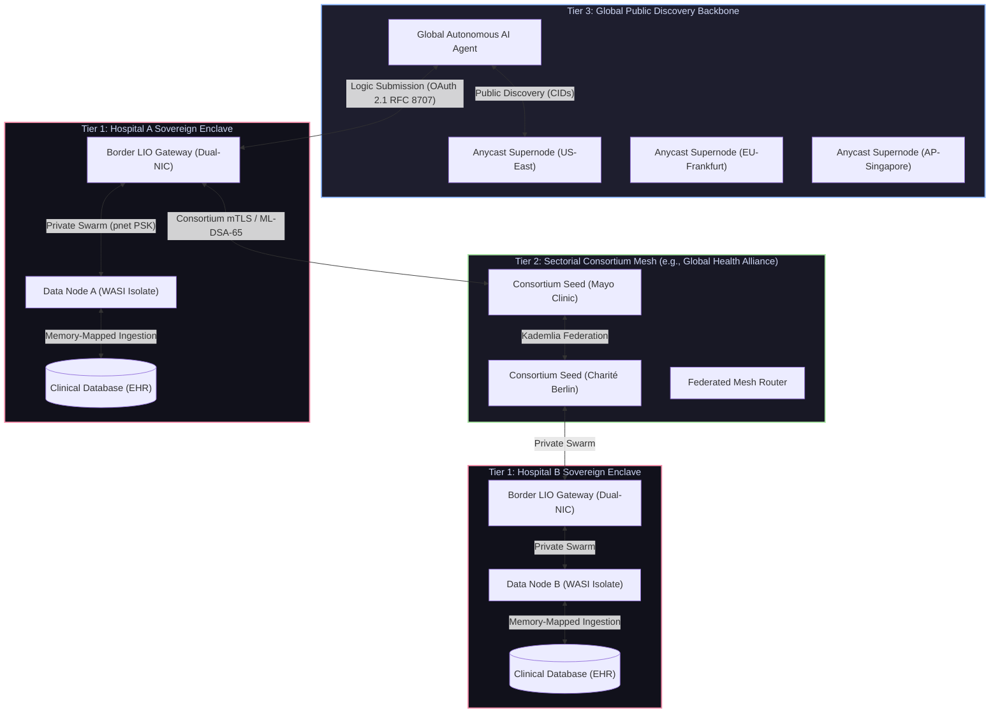

# Logic-Injection-on-Origin Protocol (LIOP)
# Canonical Network Topology Blueprint: The Tri-Tier Sovereign Mesh Architecture

> **Document Status:** Architectural Standard & Foundational Guide (The Lighthouse Blueprint)  
> **Classification:** Technical Protocol Architecture / Network Engineering & Governance  
> **Target Audience:** Systems Architects, Network Engineers, Enterprise CISO/CIOs, Protocol Contributors  
> **Ratified By:** Organization Nekzus Solutions  
> **First Ratification:** September 2026 | **Protocol Version:** 2.5+  

---

## 1. Executive Summary & Foundational Question

### The Core Architectural Dilemma
A fundamental question arises when deploying the Logic-Injection-on-Origin Protocol (LIOP) at planetary scale:
> *"Should the protocol operate as a single global public mesh connecting all nodes worldwide (analogous to the IPFS public DHT or BitTorrent Mainline), or should it operate as isolated, private, segmented networks?"*

### The Architectural Verdict
**Neither a single flat global mesh nor completely isolated private silos are viable on their own.** 

A single flat global mesh introduces catastrophic vulnerabilities (Sybil attacks, DHT routing poisoning, metadata correlation, and severe GDPR/HIPAA cross-border compliance violations). Conversely, purely isolated private meshes fragment the ecosystem into non-interoperable walled gardens, extinguishing the protocol's transformative potential as an open Machine-to-Machine (M2M) standard for autonomous AI agents.

**LIOP officially adopts the Tri-Tier Federated Sovereign Mesh Architecture**, an architecture directly modeled on the foundational design of the global Internet:

```
┌─────────────────────────────────────────────────────────────────────────┐
│              TIER 3: GLOBAL PUBLIC DISCOVERY BACKBONE                   │
│   (Public DHT, Anycast Bootstrap Supernodes, Open AI Agent Discovery)   │
└────────────────────────────────────┬────────────────────────────────────┘
                                     │ Federated Capability Exchange (FCX)
                                     ▼
┌─────────────────────────────────────────────────────────────────────────┐
│              TIER 2: SECTORIAL FEDERATED CONSORTIUM MESHES              │
│     (Health Research, Interbank Telemetry, Supply Chain, Smart Grid)    │
│     Mutual mTLS / OAuth 2.1 RFC 8707 / ML-DSA-65 Attested Allowlists    │
└────────────────────────────────────┬────────────────────────────────────┘
                                     │ Ingress Logic Boundary (LIO Only)
                                     ▼
┌─────────────────────────────────────────────────────────────────────────┐
│              TIER 1: INTRA-ORGANIZATION SOVEREIGN ENCLAVES              │
│       (Zero-Trust Private Subnets, Libp2p Swarm PSK, Host Databases)     │
│       DATA AT REST — ZERO EXTERNAL DIRECT ACCESS — INTERNAL SANDBOX     │
└─────────────────────────────────────────────────────────────────────────┘
```

---

## 2. Technical Post-Mortem of Extreme Topologies

To understand why the Tri-Tier architecture is non-negotiable, we must audit the mathematical, physical, and regulatory failure modes of the two extreme approaches.

### 2.1 Failure Mode A: The Single Flat Global Mesh (Naïve Decentralization)

In this model, every LIOP node on Earth joins a single, unstructured Kademlia DHT (`/ipfs/kad/1.0.0` or `/liop/kad/1.0.0`), sharing the same 256-bit XOR routing keyspace.

```
[Hospital Node] <───(Single Flat DHT)───> [Anonymous Malicious Peer]
  (Frankfurt)                                (Hostile Nation-State)
```

#### Catastrophic Vulnerabilities:
1. **Sybil & Eclipse Attacks on Routing Tables:**
   - In a permissionless Kademlia DHT without proof-of-work or financial staking, an adversary can generate millions of Ed25519 node identities whose SHA-256 hashes cluster around the target node's `PeerId` or its announced Content Identifiers (CIDs).
   - Once the adversary populates the $k$-buckets of surrounding nodes, they can drop query routing packets (blackholing), intercept tool invocations, or redirect queries to compromised endpoints.
2. **Metadata Leakage & Sovereign Boundary Collapse:**
   - Even if raw data never leaves the sandbox (guaranteed by WASI and the Guardian AST), **the metadata of computation is itself classified intelligence**.
   - An adversary observing DHT `FIND_NODE` and `PROVIDE` RPCs can deduce:
     - Which hospital is computing oncology biomarkers.
     - The volume and frequency of inquiries made by a specific financial institution.
     - The network topology, published multiaddrs, and uptime patterns of critical infrastructure.
   - Under GDPR (Article 44) and HIPAA Security Rule (§ 164.312), exposing network access paths and operational metadata to unverified international peers creates direct liability.
3. **Kademlia Latency Blowout in Multi-Hop WAN:**
   - Standard Kademlia lookups require $\alpha \cdot \log(N)$ routing hops. In a flat global network of 5,000,000 peers distributed transcontinentally (e.g., Sydney $\to$ Frankfurt $\to$ São Paulo $\to$ Tokyo), DHT discovery latency escalates to $3,000 \text{ ms} - 8,000 \text{ ms}$. This latency profile makes high-frequency trading or real-time clinical triage unusable.
4. **Routing Table Poisoning & Churn Exhaustion:**
   - High peer churn (thousands of edge devices joining and disconnecting per second) generates massive background traffic solely for $k$-bucket refresh and ping probes, saturating low-bandwidth edge links.

---

### 2.2 Failure Mode B: Purely Isolated Private Silos (The Walled Garden)

In this model, each enterprise runs an air-gapped or VPN-restricted deployment using libp2p Pre-Shared Keys (`pnet` / `/key/swarm/psk/1.0.0`). Node A inside Bank 1 can only talk to Node B inside Bank 1.

```
┌──────────────────┐               ┌──────────────────┐
│   Bank 1 Silo    │   NO BRIDGE   │   Bank 2 Silo    │
│  (Isolated PSK)  │ <═══════════> │  (Isolated PSK)  │
└──────────────────┘               └──────────────────┘
```

#### Critical Deficiencies:
1. **Extinction of Autonomous AI Ecosystem:**
   - Autonomous AI agents (running in Cursor, Claude Desktop, or cloud clusters) cannot discover or orchestrate multi-institution computations.
2. **Duplication of Infrastructure:**
   - Shared regulatory audits (e.g., systemic financial risk evaluation across 50 banks) require 50 bespoke point-to-point VPNs, reviving the exact brittle enterprise integration nightmare that LIOP was engineered to replace.
3. **Loss of Network Effects:**
   - The protocol degrades into an internal RPC serialization library rather than an interoperable network protocol.

---

## 3. The Canonical Solution: The Tri-Tier Sovereign Mesh

The Internet succeeded because it did not mandate a flat network. It federated autonomous networks through **Autonomous Systems (AS)**, **Border Gateway Protocol (BGP)**, and **Demilitarized Zones (DMZs)**. LIOP translates these battle-tested networking fundamentals into decentralized cryptographic computing.



---

### 3.1 Tier 1: Intra-Organization Sovereign Enclave (The Data Sanctuary)

#### Objective:
Host physical proprietary data records and execute compute in total cryptographic isolation.

#### Implementation & Architecture:
- **Network Boundaries:** Bound to internal private subnets (`10.0.0.0/8`, `172.16.0.0/12`) or loopback namespaces.
- **Access Control:** Fully air-gapped from the public internet. No public IP address, no open incoming WAN ports.
- **Mesh Transport:** Local `libp2p` instances configured with:
  - Private Swarm Key (`/key/swarm/psk/1.0.0`) derived from internal enterprise KMS.
  - Zero mDNS broadcast across external interfaces.
  - Local DHT protocol scope: `/liop/lan/kad/1.0.0`.
- **Compute Isolation:** The `WasiSandbox` runs adjacent to the host database (PostgreSQL, ClickHouse, Medical PACS, or Financial Ledgers). It accepts injected WASM logic **exclusively from the internal Border LIO Gateway**.
- **Data Guarantee:** Raw records reside in memory or disk within this enclave. They are processed by WASI, aggregated, signed with a ZK-Receipt, and passed back to the Gateway.

---

### 3.2 Tier 2: Sectorial Federated Consortium Meshes (Trust-Bound Peering)

#### Objective:
Enable secure, multi-party computation and collective intelligence across sovereign entities in a regulated industry without centralizing custody.

#### Target Domains:
- **Global Financial Defense:** Interbank fraud detection, anti-money laundering (AML), and cross-border settlement auditing (e.g., SWIFT/BIS networks).
- **Healthcare & Clinical Trials:** Multi-hospital oncology studies complying simultaneously with HIPAA (USA), GDPR (EU), and NPHIES (Middle East).
- **Critical Infrastructure & Energy:** Real-time load shedding and stability analysis across distributed electrical grid operators.

#### Implementation & Architecture:
- **Membership & Identity:**
  - Nodes must present an **ML-DSA-65 (FIPS 204)** post-quantum cryptographic identity certificate registered in the Consortium Genesis Manifest.
  - Mutual TLS (mTLS) with hot certificate reload (`CertManager`) anchored to the Consortium Root CA.
- **DHT Routing Scope:**
  - Independent Kademlia DHT using a namespaced protocol identifier:
    `protocol: "/liop/consortium/<domain-slug>/kad/1.0.0"` (e.g., `/liop/consortium/swift-aml/kad/1.0.0`).
  - Completely decoupled from the public IPFS or public LIOP DHT keyspace.
- **Authorization & Scoping:**
  - OAuth 2.1 M2M tokens enforced under **RFC 8707** (Resource Indicators for OAuth 2.0) and **RFC 9068** (JWT Profile for OAuth 2.0 Access Tokens).
  - Claim enforcement:
    ```json
    {
      "iss": "https://auth.consortium.net",
      "sub": "agent-did:liop:charite-berlin-01",
      "aud": "urn:liop:consortium:health",
      "scope": "liop:logic:inject liop:receipt:verify",
      "resource": "urn:liop:mesh:consortium"
    }
    ```

---

### 3.3 Tier 3: The Global Public Discovery Backbone (The Internet-Scale Mesh)

#### Objective:
Provide planetary discoverability for public datasets, open AI capabilities, market oracles, and public Border Gateways.

#### Implementation & Architecture:
- **Supernode Infrastructure:**
  - Maintained by the protocol foundation and accredited institutional stewards.
  - Minimum 3 geographically distributed clusters with Anycast BGP routing:
    1. **US-East** (Northern Virginia)
    2. **EU-Central** (Frankfurt)
    3. **AP-Southeast** (Singapore)
- **Bootstrap Addressing:**
  - Multiaddrs embedded into the SDK with DNSLink and DNS-over-HTTPS fallbacks:
    ```
    /dns4/seed-us.liop.network/tcp/14001/p2p/12D3KooW...
    /dns4/seed-eu.liop.network/tcp/14001/p2p/12D3KooW...
    /dns4/seed-ap.liop.network/tcp/14001/p2p/12D3KooW...
    ```
- **Public Content Routing:**
  - Standard global DHT protocol: `/liop/global/kad/2.0.0`.
  - Content Identifiers (CIDs) advertised here represent **Public Capability Descriptors** (Manifests), NOT sensitive data records.
- **Participation:**
  - Any AI agent (Cursor, Claude, AutoGPT, LangChain) can query the Global Backbone to find:
    - *"Who provides real-time sovereign FX liquidity analysis?"*
    - *"Which Border Gateways offer audited genomic variance computation?"*

---

## 4. The Critical Component: The Border LIO Gateway (BLG)

The **Border LIO Gateway (BLG)** is the architectural keystone that bridges Tier 3 / Tier 2 with Tier 1. It acts as a protocol-level firewall, Layer-7 reverse proxy, and zero-trust verification boundary.

```
                 UNTRUSTED / SEMI-TRUSTED WAN (Tier 3 / Tier 2)
                                       │
                                       ▼
  ┌────────────────────────────────────────────────────────────────────────┐
  │                      BORDER LIO GATEWAY (BLG)                          │
  │                                                                        │
  │   [Network Ingress]                                                    │
  │    ├── Dual-Protocol: HTTP/2 (gRPC) & HTTP/1.1 (gRPC-Web / MCP)        │
  │    ├── OAuth 2.1 RFC 8707 Token Validation (Resource & Scope Check)    │
  │    └── OWASP API4 Token-Bucket Rate Limiting (O(1) Sliding Window)     │
  │                                                                        │
  │   [Security Shields - Pre-Flight Ingress Inspection]                   │
  │    ├── Post-Quantum ML-KEM-768 Handshake (Session Secret Derivation)   │
  │    ├── ML-DSA-65 Signature & Manifest Verifier                         │
  │    ├── Zero-Time Guardian AST (Acorn Static Code Analysis)             │
  │    │    └── Blocks forbidden imports, ensures allowlist compliance      │
  │    └── Information Flow Control (IFC) Static Taint Analysis            │
  │                                                                        │
  │   [Dispatch Bridge]                                                    │
  │    └── Routes sanitized logic payload to internal Data Node via gRPC    │
  └────────────────────────────────────┬───────────────────────────────────┘
                                       │ Internal Secure Link (Tier 1 Enclave)
                                       ▼
  ┌────────────────────────────────────────────────────────────────────────┐
  │                   DATA NODE (Origin Compute Core)                      │
  │                                                                        │
  │   [Execution Sandbox]                                                  │
  │    ├── V8 Isolate / Wasmtime with 25 Poisoned Globals                  │
  │    ├── 11 Core Prototypes Deep-Frozen (Object.freeze)                  │
  │    ├── Deterministic AST Fuel Metering                                 │
  │    └── Local In-Memory Dataset Evaluation                              │
  │                                                                        │
  │   [Security Shields - Egress Sanitization & Attestation]              │
  │    ├── Aggregation-First Policy (Raw row export rejected)              │
  │    ├── 4-Stage Egress PII Shield (Exact, Fuzzy, Regex, NER)            │
  │    ├── NIST SP 800-226 Differential Privacy Laplace Perturbation       │
  │    └── HMAC-SHA256 ZK-Receipt Sealing (dataset_hash + output_hash)     │
  └────────────────────────────────────┬───────────────────────────────────┘
                                       │ Sealed Aggregated Response + ZK-Receipt
                                       ▼
                      BACK THROUGH BLG TO REMOTE AGENT
```

### Invariant Rules of the Border Gateway:
1. **The Ingress/Egress Asymmetry:**
   - **Ingress:** Injected Logic (Code / AST / WASM) is permitted to cross inward from Tier 3/2 to Tier 1 *if and only if* it clears the Guardian AST and Taint Analyzer.
   - **Egress:** Raw data records are **physically prevented** from crossing outward. Only aggregated, Differential Privacy-perturbed outputs with cryptographic ZK-Receipts may cross outward.
2. **Dual Network Interfaces (Physical or Virtual DMZ):**
   - **Interface A (External):** Bound to public/consortium network (`0.0.0.0:443`). Implements strict WAF, rate limiting, and DDoS mitigation.
   - **Interface B (Internal):** Bound strictly to the private enclave network (`10.0.1.0/24`).

---

## 5. Practical Deployment Matrix: Which Architecture Should You Use?

This decision matrix guides engineering teams on the exact topological configuration required for their operational profile:

| Deployment Scenario | Recommended Topology | Network Scope & Config | Identity & Auth | Encryption & Sealing |
|---|---|---|---|---|
| **Internal Enterprise Microservices** | **Tier 1 Only** (Private Enclave) | Local subnets; `enableWAN: false`; libp2p `pnet` Swarm Key; `enableMdns: true` | Internal API Keys or Service Account JWTs | AES-256-GCM; local HMAC-SHA256 ZK-Receipts |
| **Healthcare / Clinical Research Consortium** | **Tier 1 + Tier 2** (Federated Consortium) | Consortium seeds; custom DHT `/liop/health/kad/1.0.0`; AutoNAT + Relay v2 enabled | Mutual TLS (`CertManager`) + OAuth 2.1 RFC 8707 (`aud: "urn:liop:consortium"`) | ML-KEM-768 (Kyber); ML-DSA-65 signatures; NIST Differential Privacy |
| **Interbank Risk & Financial Telemetry** | **Tier 1 + Tier 2** (Regulated Peering) | Dedicated financial overlay; strict IP allowlisting; symmetric gRPC keepalive (30s) | Hardware TEE Remote Attestation + ML-DSA-65 | 1-hour PQC session key TTL; SOX-compliant dataset_hash anchor |
| **Public AI Agent Service (LIOaaS)** | **Tier 1 + Tier 3** via Border LIO Gateway | Public Anycast seeds; `/liop/global/kad/2.0.0`; Hybrid Gateway `/mcp` enabled | Public API Keys or OpenID Connect (OIDC); WebAuthn | Full 6 Shields; strict rate limiting (HTTP 429 Retry-After) |
| **Public Data Provider / Market Oracle** | **Tier 3 Only** (Public Node) | Public DHT; open announce; AutoNAT, DCUtR hole punching enabled | Public Ed25519 PeerId; signed public manifests | Public ZK-Receipts verifiable by any third-party verifier |

---

## 6. Real-World Architectural Analogy: How LIOP Mirrors the Internet

To ground this model in established engineering reality, observe how each LIOP primitive corresponds directly to the architecture that powers global internet communications:

| Internet Global Architecture Component | Traditional Function in IP Networks | LIOP Sovereign Protocol Equivalent |
|---|---|---|
| **Autonomous System (AS)** | Routing domain under a single administrative organization (e.g., AS15169 Google). | **Sovereign Organization Enclave (Tier 1)** managed under a single corporate governance policy. |
| **BGP-4 (Border Gateway Protocol)** | Protocol exchanging reachability between disparate Autonomous Systems. | **Federated Capability Exchange (FCX) & Kademlia DHT** exchanging signed compute manifests between nodes. |
| **Border Router / DMZ Firewall** | Hardware gateway filtering packet ingress into a corporate intranet. | **Border LIO Gateway (BLG) / Hybrid Gateway** inspecting WASM AST before routing logic to internal data nodes. |
| **IP Transit / Peering Fabric (IXP)** | Physical interconnects where internet service providers exchange traffic. | **Consortium Bootstrap Supernodes (Tier 2)** routing multiplexed Yamux streams between federated peers. |
| **Public DNS Root Servers (A-M)** | Globally distributed authoritative directory mapping names to IPs. | **Anycast LIOP Bootstrap Supernodes (Tier 3)** resolving capability CIDs to provider multiaddresses. |
| **Virtual Private Network (VPN / IPSec)** | Encrypted tunnel connecting trusted private endpoints across untrusted WAN. | **libp2p PNet Swarm Keys + ML-KEM-768 PQC Tunnel** isolating consortium and enterprise communication. |
| **TLS / HTTPS End-to-End Encryption** | Secures payload bytes against wiretapping during transit. | **Post-Quantum Encapsulation (ML-KEM-768) + ZK-Receipt Attestation** ensuring computational integrity. |

---

## 7. Operational Blueprint: Node Configuration Reference

Below are production configuration templates using the `@nekzus/liop` TypeScript SDK for each deployment tier.

### 7.1 Tier 1 Private Data Node (`data-node.ts`)
```typescript
import { LiopServer } from "@nekzus/liop";
import { z } from "zod";

const server = new LiopServer({
  name: "oncology-data-enclave",
  version: "2.5.0",
});

// Load proprietary data into the WASI sandbox (Data remains here permanently)
server.setSandboxData(loadInternalHospitalDatabase());

server.tool(
  "Analyze_Genomic_Variance",
  "Computes statistical variance across clinical records with Differential Privacy",
  { payload: z.string() },
  async () => ({ content: [{ type: "text", text: "Processed in-situ" }] })
);

// Connect strictly to the internal enclave network (No external WAN)
await server.connectToMesh({
  port: 50051,
  meshConfig: {
    listenAddresses: ["/ip4/10.0.1.50/tcp/50051"],
    bootstrapNodes: ["/ip4/10.0.1.10/tcp/4000/p2p/12D3KooWInternalGateway..."],
    enableWAN: false,
    enableMdns: false, // Prevent broadcast leaks across shared switches
  },
});
```

### 7.2 Tier 2 / 3 Border LIO Gateway (`border-gateway.ts`)
```typescript
import { LiopServer, LiopHybridGateway, MeshNode } from "@nekzus/liop";

const edgeServer = new LiopServer({
  name: "hospital-border-gateway",
  version: "2.5.0",
});

// Initialize multi-homed MeshNode connecting to Consortium or Public Backbone
const mesh = new MeshNode({
  listenAddresses: [
    "/ip4/0.0.0.0/tcp/14001",
    "/ip4/0.0.0.0/tcp/14002/ws"
  ],
  bootstrapNodes: [
    "/dns4/consortium-seed-1.health-mesh.org/tcp/14001/p2p/12D3KooWConsortiumSeed1...",
    "/dns4/consortium-seed-2.health-mesh.org/tcp/14001/p2p/12D3KooWConsortiumSeed2..."
  ],
  enableWAN: true,
  enableRelay: true,
  enableAutoNAT: true,
  enableDcutr: true,
});

await mesh.start();

// Announce public capability CID on behalf of internal Data Node
await mesh.announceCapability("Analyze_Genomic_Variance");

// Instantiate Hybrid Gateway exposing standard MCP (JSON-RPC) & gRPC-Web
const gateway = new LiopHybridGateway(edgeServer, mesh, 50051);
await gateway.listen(443, "0.0.0.0");
console.log("Border LIO Gateway active on port 443 with Post-Quantum protection.");
```

---

## 8. Strategic Summary: The Lighthouse Protocol Invariant

The answer to how LIOP should officially operate is codified in this permanent protocol invariant:

> ### The Sovereign Topology Invariant
> **"LIOP does not force sovereign institutions into an insecure global monoculture, nor does it abandon them in disconnected isolation. LIOP operates as a federated network of networks, where data remains anchored in sovereign Tier 1 enclaves, collaboration is mediated by cryptographically verified Tier 2 consortiums, and discoverability is powered by the Tier 3 global backbone."**

This architectural structure satisfies every enterprise regulatory framework (GDPR, HIPAA, PCI-DSS, SOC 2 Type II, FedRAMP High) while delivering on the promise of decentralized, autonomous AI computation. It is the definitive operational blueprint for the protocol's global adoption.
