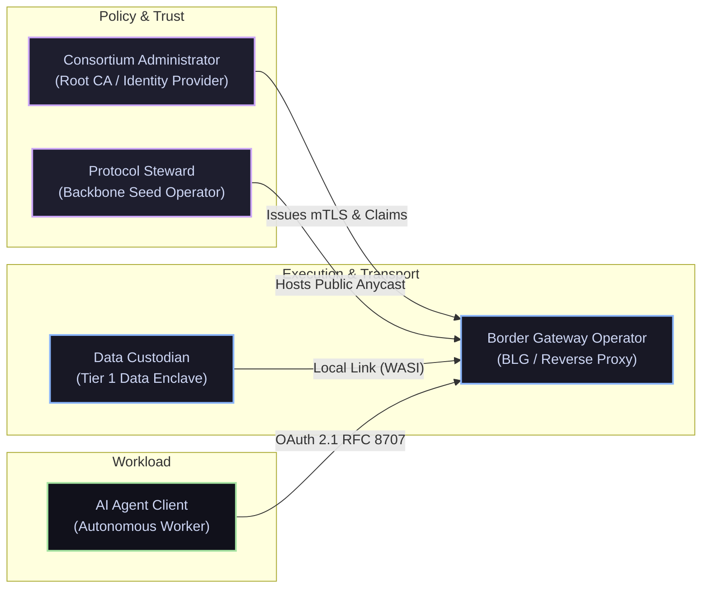
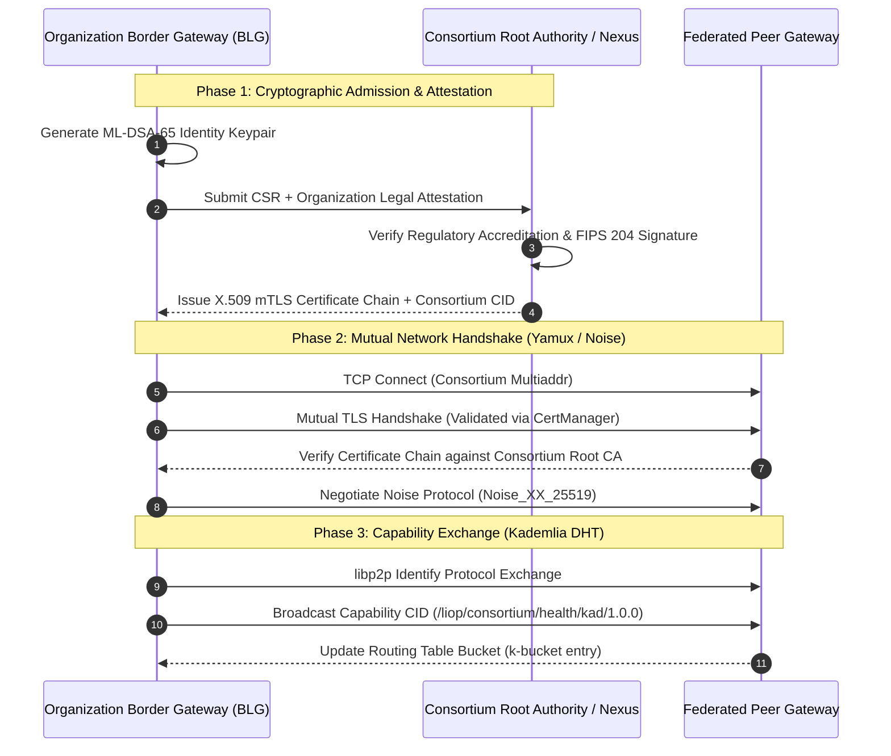
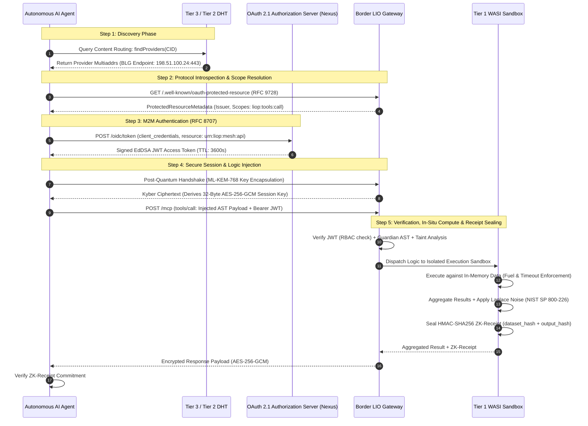
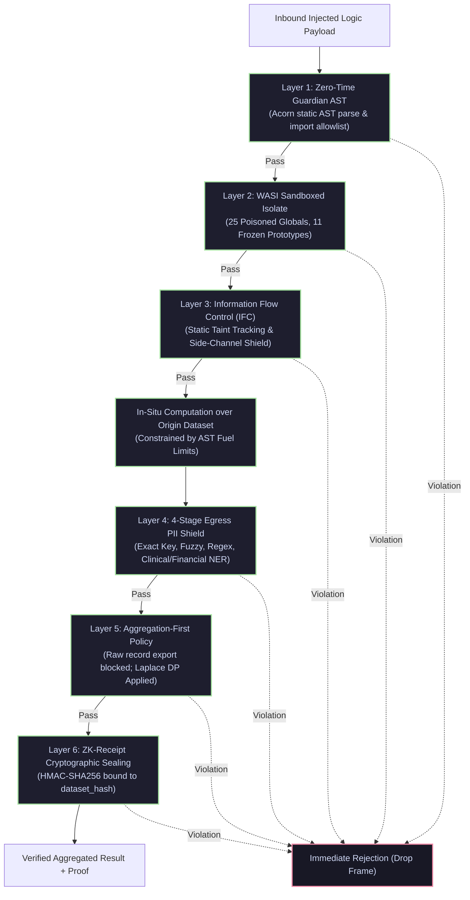

# Logic-Injection-on-Origin Protocol (LIOP)
# Sovereign Mesh Operations Manual: Architecture, Identity, Access Control & Network Governance

> **Document Status:** Official Normative Operational Standard (The Sovereign Operations Manual)  
> **Classification:** Technical Protocol Architecture / Network Engineering, IAM & Cryptographic Governance  
> **Target Audience:** Systems Architects, Network Engineers, Enterprise CISOs/CIOs, Consortium Operators, AI Engineers  
> **Ratified By:** Organization Nekzus Solutions  
> **First Ratification:** September 2026 | **Protocol Version:** 2.5+  
> **License:** [CC BY 4.0](https://creativecommons.org/licenses/by/4.0/)  
> **Attribution Required:** Any implementation, deployment, or adaptation of these operational patterns must explicitly attribute **Mauricio Ortega (Nekzus)** and **Nekzus Solutions**, and link to the official LIOP repository.

---

## Table of Contents
1. [Executive Foundations & Historical Post-Mortem: Lessons from Internet and Blockchain](#1-executive-foundations--historical-post-mortem-lessons-from-internet-and-blockchain)
2. [Ecosystem Actors, Personas, and Operational Roles](#2-ecosystem-actors-personas-and-operational-roles)
3. [End-to-End Onboarding Protocols by Network Tier](#3-end-to-end-onboarding-protocols-by-network-tier)
4. [Identity and Authentication Architecture](#4-identity-and-authentication-architecture)
5. [Granular Authorization, RBAC, and Token Governance](#5-granular-authorization-rbac-and-token-governance)
6. [Perimeter Defense: The 6-Layer Inspection Pipeline of the Border LIO Gateway (BLG)](#6-perimeter-defense-the-6-layer-inspection-pipeline-of-the-border-lio-gateway-blg)
7. [Cryptographic Lifecycle, Auditability, and Incident Response](#7-cryptographic-lifecycle-auditability-and-incident-response)
8. [Unified Architectural Matrix: Internet vs. Blockchain vs. LIOP](#8-unified-architectural-matrix-internet-vs-blockchain-vs-liop)
9. [Implementation Alignment & Planned Technical Roadmap](#9-implementation-alignment--planned-technical-roadmap)

---

## 1. Executive Foundations & Historical Post-Mortem: Lessons from Internet and Blockchain

The design of planetary-scale distributed networks has historically oscillated between two extremes: centralized hierarchical structures plagued by systemic fragility, and flat permissionless models burdened by severe throughput bottlenecks and lack of legal sovereignty. 

LIOP is engineered upon a forensic analysis of the core design flaws and structural successes of both the traditional Internet architecture (ARPANET/TCP/IP/BGP/DNS) and the decentralized state machines of modern blockchain systems (Bitcoin, Ethereum DevP2P, Layer-2 Rollups).

```
┌─────────────────────────────────────────────────────────────────────────┐
│                      HISTORICAL EVOLUTION OF NETWORKS                   │
├──────────────────────────┬──────────────────────────┬───────────────────┤
│    TRADITIONAL INTERNET  │   BLOCKCHAIN STATE-NETS  │     LIOP MESH     │
│   (BGP / DNS / Cleartext)│(Consensus / Transparent) │(Logic-on-Origin)  │
├──────────────────────────┼──────────────────────────┼───────────────────┤
│ • Implicit Trust (BGP)   │ • Zero Trust, High Cost  │ • Zero-Trust M2M  │
│ • Data Extraction (HTTP) │ • Global Redundant State │ • In-Situ Compute │
│ • Hierarchical Single-CA │ • Pseudo-Anonymous DIDs  │ • Sovereign PQC   │
│ • Cleartext Metadata     │ • High P2P Churn / PoW   │ • Tri-Tier Enclave│
└──────────────────────────┴──────────────────────────┴───────────────────┘
```

### 1.1 The Classical Internet: The Cost of Retrofitted Security

The Internet was developed in an academic and defense context characterized by high institutional trust. This operational assumption created architectural liabilities that cost hundreds of billions of dollars annually in mitigations:

1. **Border Gateway Protocol (BGP-4) and the Fallacy of Implicit Trust:**
   - *The Defect:* BGP was established without cryptographic proof of route authorization. Routers implicitly trust routing advertisements from connected Autonomous Systems (AS). 
   - *The Failure:* Route hijacking, AS-PATH spoofing, and accidental prefix leaks routinely re-route global financial, government, and civilian traffic through hostile infrastructure. Retrofitting **RPKI (Resource Public Key Infrastructure)** and **ROV (Route Origin Validation)** has required more than three decades, and remains only partially adopted.
   - *The LIOP Solution:* LIOP implements **Identity-First Cryptographic Routing**. No route or capability is ever accepted based on topological adjacency. Every peer announcement across the Kademlia Distributed Hash Table (DHT) requires cryptographic attestation via **ML-DSA-65 (FIPS 204)** digital signatures and Ed25519 PeerIDs. Unsigned or invalid capability descriptors are dropped at the frame layer before ingestion.

2. **The Public Key Infrastructure (PKI) "Weakest Link" Trap:**
   - *The Defect:* Traditional Web PKI delegates certificate issuance to hundreds of commercial Certificate Authorities (CAs) embedded into operating systems. If a single CA is breached (e.g., DigiNotar, Comodo, DarkMatter), fraudulent certificates can be issued for any domain on Earth.
   - *The Failure:* Hierarchical Web PKI is brittle and susceptible to nation-state coercion. Certificate pinning attempts resulted in catastrophic service outages when keys rotated.
   - *The LIOP Solution:* LIOP completely decouples network integrity from commercial public CAs. In Tier 2 federations, identity is established via **pinned consortium root anchors** evaluated by local `CertManager` instances with automated hot-reloading. In Tier 3, identity is derived mathematically from the peer's public key (self-certifying addresses), preventing third-party CA subversion.

3. **Domain Name System (DNS) and Unencrypted Metadata:**
   - *The Defect:* DNS was designed in cleartext UDP. Even with DNSSEC, query lookups broadcast user and agent intentions across local network segments and transit providers.
   - *The Failure:* Cache poisoning, DNS spoofing, and pervasive metadata surveillance. 
   - *The LIOP Solution:* Addressing in LIOP utilizes libp2p **Multiaddresses (`multiaddr`)** and **Content Identifiers (CIDs)** resolved directly over encrypted Noise transports (`Noise_XX_25519_ChaChaPoly_SHA256`) and Post-Quantum Key Encapsulation (`ML-KEM-768`). No cleartext resolution queries traverse the transport wire.

---

### 1.2 Blockchain Networks: The Scalability and Privacy Trilemma

Blockchain technology demonstrated that decentralized coordination without central authorities is mathematically viable. However, applying naive blockchain patterns to high-throughput data operations and AI workloads reveals severe architectural dead ends:

1. **The Fallacy of Global State Replication:**
   - *The Defect:* Blockchains require every full node to process and store every transaction in a global linear ledger.
   - *The Failure:* Planetary consensus bottlenecks network throughput ($15 \text{ to } 2,000 \text{ TPS}$), inflates compute costs, and creates massive storage bloat.
   - *The LIOP Solution:* **LIOP is not a blockchain.** LIOP requires zero global consensus on transactions. In accordance with the **Logic-Injection-on-Origin (LIO)** postulate, computation executes exclusively at the physical point of origin (Tier 1 Enclave). Only mathematical aggregations and cryptographically verifiable **ZK-Receipts** cross the network boundary. Concurrency scales linearly $O(N)$ with the addition of independent data nodes without consensus synchronization drag.

2. **The Public Ledger Privacy Dilemma:**
   - *The Defect:* Data written to a public blockchain or IPFS cluster is immutable and publicly visible. Even with zero-knowledge rollups, metadata, access frequencies, and transaction volumes are permanently etched into public ledgers.
   - *The Failure:* Strict regulatory incompatibility with **GDPR (Article 17 "Right to be Forgotten", Article 44 "Cross-Border Data Transfers")** and **HIPAA Security Rule (§ 164.312)**. Sensitive health or banking data cannot legally reside on a replicated public state machine.
   - *The LIOP Solution:* **Data at Rest Invariant.** Proprietary records never leave their origin database. No distributed ledger holds patient histories, bank balances, or proprietary trade secrets. The compute sandbox executes ephemerally inside the origin enclave and discards memory state post-execution.

3. **DevP2P Peer Discovery Lessons (Ethereum Discv4 vs. Discv5):**
   - *The Breakthrough:* Ethereum demonstrated that peer-to-peer discovery over Kademlia requires explicit capability signaling (Node Records / ENR in Discv5) to prevent connecting to incompatible nodes before completing expensive cryptographic handshakes.
   - *The LIOP Solution:* LIOP incorporates this exact model. Peer capabilities are packaged as **Signed Manifests** containing tool schemas, required OAuth scopes, post-quantum signatures, and taxonomy classifications, broadcasted via Kademlia content routing (`contentRouting.provide`). Remote gateways inspect capabilities before initiating gRPC transport sessions.

---

## 2. Ecosystem Actors, Personas, and Operational Roles

The operation of a federated sovereign mesh requires clear separation of responsibilities among five distinct ecosystem personas.



### 2.1 Detailed Role Taxonomy

| Role Identifier | Operational Boundary | Primary Cryptographic Assets | Core Responsibility |
|---|---|---|---|
| **Data Custodian** | Tier 1 (Intra-Organization Enclave) | Database credentials, Host KMS Master Key, HMAC Secret | Owns physical databases. Binds in-situ `WasiSandbox` to local tables. Freezes globals, enforces fuel metering, seals ZK-Receipts. |
| **Consortium Administrator** | Tier 2 (Federation Level) | Consortium Root CA Private Key, OIDC Signing Key (Ed25519) | Governs admission to sectorial meshes. Issues client credentials, rotates federation certificates, revokes compromised members. |
| **Border Gateway Operator (BLGO)** | DMZ Boundary (Tier 2/3 $\leftrightarrow$ Tier 1) | TLS Server Certs, ML-KEM-768 Decapsulation Key, ML-DSA-65 Private Key | Maintains the dual-NIC Border LIO Gateway. Executes Guardian AST parsing, Taint Tracking, WAF rate-limiting, and gRPC routing. |
| **AI Agent Client** | External WAN / Enterprise Cluster | OAuth 2.1 Client Secret / Keypair, ML-KEM-768 Ephemeral Key | Submits computational logic to the mesh. Consumes tools via MCP JSON-RPC, validates HMAC-SHA256 ZK-Receipts and Differential Privacy noise. |
| **Protocol Steward** | Tier 3 (Global Discovery Backbone) | Anycast BGP Peering Keys, Seed PeerIDs | Maintains geo-distributed bootstrap supernodes in Tier 3. Facilitates public CID discovery and WAN connectivity without touching customer traffic. |

---

## 3. End-to-End Onboarding Protocols by Network Tier

Connecting nodes and agents to the LIOP mesh follows strict state machines tailored to each architectural tier.

### 3.1 Tier 1 Onboarding: Intra-Organization Sovereign Enclave

The Tier 1 Data Node represents the secure core. It never binds to public network interfaces and operates under zero-trust assumptions.

```
┌────────────────────────────────────────────────────────────────────────┐
│                      TIER 1 DATA NODE PROVISIONING                      │
├────────────────────────────────────────────────────────────────────────┤
│ Step 1: Physical Data Linkage (Read-Only Connection to Local Database)  │
│ Step 2: Instantiation of WasiSandbox (Poison 25 Globals, Freeze V8)   │
│ Step 3: Registration of Logic-Injection Tools via Zod Schemas          │
│ Step 4: Binding to Private Local Subnet (10.0.0.0/8 or Loopback)       │
│ Step 5: Disable Public WAN & Multicast (enableWAN: false, mDNS: false) │
│ Step 6: P2P Association with Local Border LIO Gateway via Multiaddr    │
└────────────────────────────────────────────────────────────────────────┘
```

#### Production Tier 1 Node Implementation (`enclave-node.ts`):
```typescript
import { LiopServer } from "@nekzus/liop";
import { z } from "zod";

// Initialize data node within sovereign perimeter
const enclaveServer = new LiopServer({
  name: "oncology-data-enclave",
  version: "2.5.0",
  auth: { role: "none" }, // Auth is offloaded to the Border Gateway at the perimeter
});

// Bind database in-memory snapshot to WASI isolate (Data never leaves this process)
enclaveServer.setSandboxData([
  { id: "PAT-001", age: 58, biomarker: "EGFR_MUT", responseRate: 0.84 },
  { id: "PAT-002", age: 62, biomarker: "KRAS_WT", responseRate: 0.12 },
]);

// Expose Logic-on-Origin processing tool
enclaveServer.tool(
  "Analyze_Biomarker_Efficacy",
  "Executes statistical variance analysis on clinical trial cohort",
  { targetBiomarker: z.string() },
  async (args: { targetBiomarker: string }) => {
    // Execution occurs strictly in-situ within V8 Isolate
    return {
      content: [{ type: "text", text: "Cohort processing complete." }],
    };
  }
);

// Connect strictly to internal network interface
await enclaveServer.connectToMesh({
  port: 50051,
  meshConfig: {
    listenAddresses: ["/ip4/10.0.1.50/tcp/50051"],
    bootstrapNodes: [
      "/ip4/10.0.1.10/tcp/4000/p2p/12D3KooWInternalGatewayRootIdAnchor",
    ],
    enableWAN: false,
    enableMdns: false, // Prevent multicast leakage across VLANs
  },
});

console.log("[Enclave] Tier 1 Data Node active on internal IP 10.0.1.50:50051");
```

---

### 3.2 Tier 2 Onboarding: Sectorial Federated Consortium Peering

Organizations joining a federated consortium (e.g., Global Clinical Trial Network, SWIFT Interbank Fraud Prevention) must complete mutual attestation before participating in the consortium's Kademlia DHT.



#### Production Tier 2 Gateway Implementation (`consortium-gateway.ts`):
```typescript
import { LiopServer, LiopHybridGateway, MeshNode } from "@nekzus/liop";
import { CertManager } from "@nekzus/liop/security";

// 1. Initialize Certificate Manager for automated mTLS monitoring & hot-reloading
const certManager = new CertManager({
  rootCertPath: "/etc/liop/certs/consortium-root-ca.pem",
  certChainPath: "/etc/liop/certs/hospital-blg-chain.pem",
  privateKeyPath: "/etc/liop/certs/hospital-blg-key.pem",
  warningDays: 30,
  watchFiles: true,
});

// Verify validity of local certificates on startup
const certStatus = certManager.inspectCertificate();
if (certStatus.isExpired) {
  throw new Error(`[BLG-Init] Certificate expired on ${certStatus.validTo}`);
}

// 2. Configure multi-homed MeshNode for Consortium Kademlia Routing
const mesh = new MeshNode({
  listenAddresses: [
    "/ip4/198.51.100.24/tcp/14001",
    "/ip4/198.51.100.24/tcp/14002/ws",
  ],
  bootstrapNodes: [
    "/dns4/consortium-seed-1.health-mesh.org/tcp/14001/p2p/12D3KooWSeedAlpha",
    "/dns4/consortium-seed-2.health-mesh.org/tcp/14001/p2p/12D3KooWSeedBeta",
  ],
  enableWAN: true,
  enableAutoNAT: true,
  enableRelay: true,
  enableDcutr: true,
});

await mesh.start();

// Announce capability CID scoped strictly to consortium discovery
await mesh.announceCapability("Analyze_Biomarker_Efficacy");

// 3. Instantiate Border Gateway routing to internal Tier 1 Data Node
const gatewayServer = new LiopServer({
  name: "hospital-border-gateway",
  version: "2.5.0",
  auth: {
    role: "node",
    issuer: "https://auth.health-consortium.org/oidc",
    audience: "urn:liop:consortium:health",
  },
});

const gateway = new LiopHybridGateway(gatewayServer, mesh, 50051);
await gateway.listen(443, "0.0.0.0");
console.log("[Consortium] BLG active on port 443 with mTLS & OAuth 2.1 RFC 8707 enforcement");
```

---

### 3.3 Tier 3 Onboarding: Global Public Discovery Backbone

The Tier 3 backbone provides global discovery for open datasets, public API tools, market oracles, and public gateways.

```
┌────────────────────────────────────────────────────────────────────────┐
│                  TIER 3 PUBLIC BACKBONE ANNOUNCEMENT                   │
├────────────────────────────────────────────────────────────────────────┤
│ • Bootstrap Seed Supernodes maintain Anycast BGP across 3 Continents:  │
│     - US-East (Virginia)     : seed-us.liop.network                    │
│     - EU-Central (Frankfurt) : seed-eu.liop.network                    │
│     - AP-Southeast (Singapore): seed-ap.liop.network                   │
│ • Nodes announce CIDs via global DHT: /liop/global/kad/2.0.0           │
│ • CIDs point to Public Service Manifests (Schemas, Endpoints, Scopes) │
│ • Absolutely NO proprietary data or PII is ever published to Tier 3   │
│ • Public Agents discover endpoints and establish direct BLG sessions  │
└────────────────────────────────────────────────────────────────────────┘
```

---

### 3.4 AI Agent Client Lifecycle: Discovery to Execution

Autonomous AI agents (such as Claude Desktop, Cursor, or autonomous microservices) consume LIOP services through a standardized 5-step lifecycle:



---

## 4. Identity and Authentication Architecture

In LIOP, identity is cryptographic, self-sovereign, and verifiable without reliance on centralized identity registries.

### 4.1 Node Identity: Dual-Layer Cryptographic Anchors

Every LIOP node possesses two distinct cryptographic keypairs:

1. **Transport Layer Identity (Ed25519):**
   - Implements the standard `libp2p` peer identity format.
   - The `PeerId` is derived as the SHA-256 multihash of the Ed25519 public key (e.g., `12D3KooW...`).
   - Secures the transport channel via Noise Protocol Handshake (`Noise_XX_25519_ChaChaPoly_SHA256`).

2. **Attestation Layer Identity (Post-Quantum ML-DSA-65):**
   - Implements the NIST FIPS 204 Post-Quantum Digital Signature Standard.
   - Used to cryptographically sign the node's **Service Manifest** (`pqcSignature`).
   - Guarantees that declared capabilities, tool schemas, and routing endpoints cannot be tampered with or forged by intermediate transport relays.

---

### 4.2 Client and Agent Identity: M2M OAuth 2.1 Profile

LIOP explicitly eliminates human-interactive login flows (Authorization Code + PKCE) at the mesh protocol layer. Machines, autonomous agents, and background daemons interact exclusively via **M2M Client Credentials Grant** hardened under **RFC 8707** and **RFC 9068**.

#### Mandatory JWT Claims Profile:
```json
{
  "iss": "http://10.0.1.10:3000/oidc",
  "sub": "client_id_autonomous_agent_01",
  "aud": "urn:liop:mesh:api",
  "scope": "liop:tools:list liop:tools:call",
  "resource": "urn:liop:mesh:api",
  "exp": 1756857600,
  "iat": 1756854000,
  "jti": "8f3b2a1c-9e4d-4b8a-9213-f6a7d5c8e12b"
}
```

#### Security Directives for Access Tokens:
- **Signing Algorithm Whitelist:** Strictly restricted to `EdDSA` (Ed25519) and `ES256`. Legacy RSA (`RS256`, `RS384`, `RS512`) and symmetric HMAC (`HS256`) are rejected at the validator layer to eliminate algorithm confusion attacks (OWASP API-A01).
- **Short-Lived Lifespans:** Token Time-To-Live (TTL) is strictly bounded to $3,600 \text{ seconds}$ ($1 \text{ hour}$). Refresh tokens are disabled for M2M profiles to prevent token stockpiling.
- **Fail-Closed Verification:** If the token signature cannot be verified, if the issuer is not recognized, or if the audience does not match `urn:liop:mesh:api`, the request is rejected with JSON-RPC error code `-32099` (`Authentication Required`).

---

### 4.3 Automated Discovery via Protected Resource Metadata (PRM)

To eliminate hardcoded authentication endpoints in client configurations, all LIOP Border Gateways implement **RFC 9728 (OAuth 2.0 Protected Resource Metadata)**.

When an unauthenticated client or agent queries the gateway:
1. The gateway returns HTTP status `401 Unauthorized` with the `WWW-Authenticate` header pointing to `/.well-known/oauth-protected-resource`.
2. The agent queries `GET /.well-known/oauth-protected-resource` and receives the machine-readable descriptor built by `prm.ts`:
   ```json
   {
     "resource": "urn:liop:mesh:api",
     "authorization_servers": ["https://auth.health-consortium.org/oidc"],
     "scopes_supported": [
       "liop:tools:list",
       "liop:tools:call",
       "liop:resources:read",
       "liop:schema:read",
       "liop:mesh:query"
     ],
     "bearer_methods_supported": ["header"],
     "resource_documentation": "https://github.com/nekzus/liop"
   }
   ```
3. The agent dynamically negotiates tokens with the specified Authorization Server before re-submitting its computation payload.

---

### 4.4 Identity Model Comparison: Internet vs. Blockchain vs. LIOP

| Architectural Vector | Internet Web PKI (X.509) | Blockchain (W3C DID / VCs) | LIOP Sovereign Identity |
|---|---|---|---|
| **Root of Trust** | Hundreds of Commercial CAs (Public Trust Store) | Distributed Ledger / Smart Contract Registry | Mathematical Self-Attestation + Consortium Root CA |
| **Post-Quantum Readiness** | Poor (RSA-2048 / ECC P-256 still dominant) | Slow migration (secp256k1 dominant in EVM/BTC) | **Native ML-DSA-65 & ML-KEM-768 (FIPS 203/204)** |
| **Revocation Model** | CRL / OCSP (High failure rate, soft-fail default) | On-chain revocation registries (Gas cost required) | **Cryptographic Hash-Chain TRL + CertManager Reload** |
| **Resolution Latency** | Fast (DNS + Cached OCSP) | Slow ($2 \text{ to } 60 \text{ seconds}$ on-chain confirmation) | **Zero-Latency In-Memory Validation ($< 1 \text{ ms}$)** |

---

## 5. Granular Authorization, RBAC, and Token Governance

Authentication proves *who* an entity is. Authorization governs *what* that entity is permitted to compute.

### 5.1 The LIOP Scope Hierarchy

LIOP maps JSON-RPC / MCP methods strictly to fine-grained OAuth scopes. In accordance with **NIST SP 800-207 §4.3 (Least Privilege)**, scopes are validated deterministically prior to payload parsing or AST execution.

```
┌─────────────────────────────────────────────────────────────────────────┐
│                        LIOP RBAC SCOPE MAPPING                          │
├──────────────────────────┬──────────────────────┬───────────────────────┤
│ MCP Method               │ Required LIOP Scope  │ Access Level Granted  │
├──────────────────────────┼──────────────────────┼───────────────────────┤
│ initialize               │ None (Public)        │ Protocol Handshake    │
│ ping                     │ None (Public)        │ Liveness Check        │
│ notifications/*          │ None (Public)        │ State Notification    │
│ tools/list               │ liop:tools:list      │ Capability Discovery  │
│ tools/call               │ liop:tools:call      │ Logic Injection Core  │
│ resources/list           │ liop:resources:read  │ Schema & Resource Read│
│ resources/read           │ liop:resources:read  │ Static Manifest Read  │
│ prompts/list             │ liop:schema:read     │ Template Inspection   │
│ prompts/get              │ liop:schema:read     │ Template Retrieval    │
│ * (Unknown Method)       │ DENIED (Fail-Closed) │ Blocked by Default    │
└──────────────────────────┴──────────────────────┴───────────────────────┘
```

---

### 5.2 Deterministic Decision Logic (`authorizeRequest`)

The RBAC engine follows a strict 4-stage evaluation tree:

```typescript
// Formal decision logic from sdks/typescript/src/security/rbac.ts
export function authorizeRequest(
  method: string,
  auth: AuthInfo | null,
  additionalScopes?: readonly string[]
): AuthorizationResult {
  const methodScopes = SCOPE_MAP[method];

  // 1. Explicitly public endpoints pass unconditionally
  if (methodScopes !== undefined && methodScopes.length === 0) {
    return { allowed: true };
  }

  // 2. Secured endpoints without auth context fail immediately
  if (!auth) {
    return {
      allowed: false,
      reason: `Authentication required for method: ${method}`,
    };
  }

  // 3. Merge method scopes with node-specific restricted scopes
  const needed = [...(methodScopes ?? []), ...(additionalScopes ?? [])];

  // 4. Unknown methods fail-closed per NIST SP 800-207
  if (needed.length === 0) {
    return {
      allowed: false,
      reason: `Unknown method: ${method}. Access denied (fail-closed).`,
    };
  }

  // 5. Verify all required scopes are present in the JWT
  const clientScopes = new Set(auth.scopes);
  const missing = needed.filter((s) => !clientScopes.has(s));

  if (missing.length > 0) {
    return {
      allowed: false,
      reason: `Insufficient scopes for ${method}. Missing: ${missing.join(", ")}`,
    };
  }

  return { allowed: true };
}
```

---

### 5.3 Authority Aliasing and Docker NAT Traversal

In containerized and Kubernetes topologies (such as Docker Desktop or microservice meshes), authorization servers resolve under disparate hostnames depending on the network vantage point:
- *Internal Container Network:* `http://nexus:3000`
- *Host Published Port:* `http://127.0.0.1:13000`
- *Service Mesh Ingress:* `http://liop-nexus:3000`

Standard JWT validation libraries fail if the `iss` (issuer) claim does not match an exact string literal. LIOP resolves this through **Authority Aliasing** in `JwtValidator.buildIssuerAliases()`:
- The validator maps known equivalent authorities across loopback, container names, and published ports.
- The cryptographic signature remains strictly validated against the public JWKS. Only string comparison of the authority host is relaxed across verified network aliases, preventing false-positive authentication drops across container boundaries.

---

### 5.4 Token Revocation Lists (TRL)

When a client key is compromised or an agent process goes rogue, tokens must be revocable prior to their 1-hour expiration.

- **Resource Token Revocation List (TRL):**
  - Gateways maintain an in-memory hash set of revoked tokens indexed by their SHA-256 digest: `SHA256(raw_jwt)`.
  - Checking revocation is an $O(1)$ memory lookup taking $< 5 \text{ microseconds}$.
  - The TRL is persisted locally to a JSON ledger (`revocationPath`) and synchronized across consortium peers via libp2p pub/sub.

---

### 5.5 Multi-Tier Rate Limiting (Anti-DoS Defense)

To prevent resource exhaustion from distributed denial-of-service (DDoS) or misconfigured recursive AI loops, gateways enforce token-bucket rate limiting:
- **Rate Limit Window:** 60-second sliding window with microsecond resolution.
- **Client Bucketing:** Keyed by remote authenticated `clientId` (or remote IP for unauthenticated discovery endpoints).
- **Throttling Action:** Exceeding thresholds returns HTTP status `429 Too Many Requests` with the standard `Retry-After: <seconds>` header.

---

## 6. Perimeter Defense: The 6-Layer Inspection Pipeline of the BLG

The **Border LIO Gateway (BLG)** enforces an absolute asymmetric policy:
- **Ingress:** Code enters *only* if statically proven safe.
- **Egress:** Raw data *never* exits. Only aggregations with cryptographic proofs exit.



### 6.1 Layer-by-Layer Defense Specifications

1. **Layer 1: Zero-Time Guardian AST (Pre-Execution Gatekeeper):**
   - Parses the submitted logic string into an Abstract Syntax Tree (AST) using Acorn with `{ allowReturnOutsideFunction: true }`.
   - Validates all function calls against a strict 14-symbol allowlist: `Math.abs`, `Math.min`, `Math.max`, `Math.round`, `Math.floor`, `Math.ceil`, `Math.sqrt`, `Math.pow`, `Array.prototype.map`, `filter`, `reduce`, `find`, `length`, and `JSON.stringify`.
   - Blocks dynamic code evaluation (`eval`, `Function`, `setTimeout`, `setInterval`).

2. **Layer 2: WASI Sandbox & Prototype Freezing:**
   - Deployed within a dedicated V8 Isolate or Wasmtime runtime.
   - Actively poisons 25 host environment globals (`process`, `require`, `fs`, `net`, `http`, `child_process`, `globalThis`, etc.).
   - Pre-execution freezing of 11 core JavaScript prototypes via `Object.freeze()` to neutralize Prototype Pollution attacks (CWE-915).
   - Enforces deterministic fuel metering: execution aborts if fuel drops below zero.

3. **Layer 3: Information Flow Control (IFC) & Taint Tracking:**
   - Inspects the AST for implicit and explicit side-channel exfiltration patterns.
   - Detects character-by-character derivation attacks (e.g., `str.charCodeAt(0) > 65 ? true : false`) that attempt to leak private strings across boolean query results.

4. **Layer 4: 4-Stage Egress PII Shield:**
   - Evaluates all candidate response outputs through four sequential filters:
     1. *Exact Key Match:* Identifies direct leaks of forbidden field names (`ssn`, `iban`, `credit_card`, `password`).
     2. *Fuzzy Key Match:* Detects obfuscated field variations (`c_card`, `s-s-n`, `pass_wrd`).
     3. *Regex Pattern Scanning:* Validates against Luhn-checked credit cards, US SSN patterns, and IBAN structures.
     4. *Named Entity Recognition (NER):* Flags names, physical addresses, and clinical medical records.

5. **Layer 5: Aggregation-First & Differential Privacy Policy:**
   - Validates that returned data represents a mathematical reduction ($N \to 1$ or $N \to M$ where $M \ll N$).
   - Rejects queries that attempt to return raw arrays of database entities.
   - Injects mathematically bounded Laplace noise ($\epsilon, \delta$) per **NIST SP 800-226** guidelines to preserve differential privacy.

6. **Layer 6: ZK-Receipt Cryptographic Sealing:**
   - Derives a deterministic cryptographic receipt binding:
     $$\text{Receipt} = \text{HMAC-SHA256}_{K_{\text{session}}}\left(\text{dataset\_hash} \parallel \text{logic\_hash} \parallel \text{output\_hash}\right)$$
   - The remote client or agent verifies this receipt against the shared post-quantum session secret, mathematically proving that the computation executed over the genuine, untampered origin dataset without requiring sight of the data itself.

---

## 7. Cryptographic Lifecycle, Auditability, and Incident Response

Cryptographic security is perishable. Keys, certificates, and nodes must undergo continuous automated lifecycle management.

### 7.1 Key and Session Lifecycles

| Cryptographic Primitive | Algorithm / Standard | Lifespan / TTL | Rotation Mechanism |
|---|---|---|---|
| **PQC Session Encryption** | ML-KEM-768 (FIPS 203) + AES-256-GCM | 1 Hour ($3,600 \text{ s}$) | Automated silent re-keying over existing Yamux stream |
| **Node Identity Attestation** | ML-DSA-65 (FIPS 204) | 1 Year | Offline CA re-certification with updated Genesis Manifest |
| **M2M Access Tokens** | Ed25519 (EdDSA) JWT | 1 Hour ($3,600 \text{ s}$) | Ephemeral generation via OAuth 2.1 token endpoint |
| **Consortium mTLS Certs** | X.509 (ECDSA P-256 / Ed25519) | 90 Days | Non-disruptive hot-reload via `CertManager` file watching |

---

### 7.2 Non-Disruptive mTLS Hot-Reloading (`CertManager`)

In high-availability consortium deployments, restarting nodes to rotate TLS certificates introduces downtime and breaks active peer connections.

`CertManager` monitors certificate files via non-blocking filesystem watchers (`fs.watch`) with debounce filtering:
1. When automated certificate bots (e.g., Certbot, Vault, Smallstep) write renewed `.pem` files, `CertManager` loads the new buffers.
2. It validates the new chain using Node.js native `crypto.X509Certificate`.
3. It updates internal SSL contexts in memory and emits the `reload` event.
4. Active gRPC streams continue uninterrupted; new incoming connections immediately utilize the renewed certificate chain.

---

### 7.3 Immutable Audit Logging: SOC 2 Type II & HIPAA Compliance

Every Logic-on-Origin invocation must generate a tamper-evident audit record. LIOP implements an **Append-Only Cryptographic Hash-Chain** (`audit-logger.ts`):

$$\text{EntryHash}_i = \text{SHA256}\left(\text{Entry}_i \parallel \text{EntryHash}_{i-1}\right)$$

```json
{
  "id": "e4b1c7a2-9d3f-4e8b-b1a6-7c2d5e8f9a0b",
  "timestamp": "2026-09-02T19:30:00.000Z",
  "traceId": "a1b2c3d4e5f60718293a4b5c6d7e8f90",
  "agentDid": "agent:client_id_autonomous_agent_01",
  "peerId": "12D3KooWBankNodeMainnetAlpha",
  "toolName": "Analyze_Biomarker_Efficacy",
  "datasetHash": "e3b0c44298fc1c149afbf4c8996fb92427ae41e4649b934ca495991b7852b855",
  "fuelConsumed": 1420,
  "outputHash": "7d8f9a0b1c2d3e4f5a6b7c8d9e0f1a2b3c4d5e6f7a8b9c0d1e2f3a4b5c6d7e8f",
  "zkReceiptSig": "AQEQIAAAAAEBAQEBAQ...",
  "status": "SUCCESS",
  "prevEntryHash": "0000000000000000000000000000000000000000000000000000000000000000",
  "entryHash": "5a4b3c2d1e0f9a8b7c6d5e4f3a2b1c0d9e8f7a6b5c4d3e2f1a0b9c8d7e6f5a4b"
}
```

If an adversary alters a historical record, the hash-chain breaks, and `verifyIntegrity()` flags the exact compromised index, providing non-repudiation for regulatory audits.

---

### 7.4 Compromised Node Incident Response Playbook

When a node's physical host is breached or its keys are leaked:

```
┌────────────────────────────────────────────────────────────────────────┐
│                   COMPROMISED NODE INCIDENT PLAYBOOK                   │
├────────────────────────────────────────────────────────────────────────┤
│ 1. REVOKE: Consortium Admin revokes node certificate in Root CA CRL.   │
│ 2. BLACKLIST: Broadcast node PeerId & ML-DSA-65 key across TRL pub/sub.│
│ 3. PURGE: Peer BLGs immediately sever active Yamux streams and drop IP.│
│ 4. DHT UNPUBLISH: Supernodes evict node CIDs from Kademlia k-buckets.  │
│ 5. ROTATE: Data Custodian destroys local keys, regenerates master KMS. │
│ 6. AUDIT: Run verifyIntegrity() on local AuditLogger hash-chain.       │
└────────────────────────────────────────────────────────────────────────┘
```

---

## 8. Unified Architectural Matrix: Internet vs. Blockchain vs. LIOP

This comparative matrix synthesizes how LIOP integrates the battle-tested engineering of the Internet with the cryptographic guarantees of modern decentralized systems:

| Architectural Vector | Traditional Internet (HTTP / BGP / Web PKI) | Public Blockchain (Ethereum / Rollups) | Sovereign Mesh (LIOP Tri-Tier Architecture) |
|---|---|---|---|
| **Fundamental Paradigm** | Context-Pulling (Data extracted to client) | Distributed State Machine (Global Ledger Replication) | **Logic-Injection-on-Origin (Compute pushed to data)** |
| **Trust Model** | Implicit Trust (Perimeter defenses, vulnerable to BGP leaks) | Trustless (Consensus overhead, high compute cost) | **Zero-Trust (NIST SP 800-207, continuous cryptographic verification)** |
| **Scalability Profile** | High bandwidth, $O(N)$ data transfer overhead | Severe bottleneck ($15 - 2,000 \text{ TPS}$, global consensus drag) | **Unbounded Horizontal Linear Scaling $O(1)$ constant transfer** |
| **Post-Quantum Posture** | Vulnerable ("Harvest Now, Decrypt Later" threat) | Vulnerable (Classical ECDSA secp256k1 keys) | **Native ML-KEM-768 (Kyber) & ML-DSA-65 (Dilithium)** |
| **Regulatory Compliance** | Poor (Data exports trigger cross-border GDPR/HIPAA penalties) | Impossible (Public ledgers violate Right to be Forgotten) | **Native Compliance (Data remains at rest; only ZK aggregations egress)** |
| **Identity & Routing** | IP addresses + Cleartext DNS | Pseudo-anonymous wallet addresses | **Ed25519 PeerIDs + Multiaddrs + Content CIDs** |
| **Access Control** | Fragmented (API keys, session cookies, bearer tokens) | Smart contract function modifiers (Publicly viewable ACLs) | **OAuth 2.1 RFC 8707 M2M Tokens + Fine-Grained RBAC Scopes** |
| **Integrity Guarantees** | None (Payload integrity relies on transient TLS) | Cryptographic consensus (Blocks & Merkle Trees) | **Cryptographic ZK-Receipts (HMAC-SHA256 bound to dataset_hash)** |

---

## 9. Implementation Alignment & Planned Technical Roadmap

### 9.1 Audited Status in `@nekzus/liop@2.5.0`

The production package `@nekzus/liop@2.5.0` fully implements the following cryptographic, networking, and governance modules:
- ✅ **RBAC Engine:** Scope-based authorization across MCP methods (`security/rbac.ts`).
- ✅ **JWT Token Validator:** Dual-mode JWKS resolution with authority aliasing (`security/jwt-validator.ts`).
- ✅ **Embedded OAuth 2.1 Server:** Hardened for M2M Client Credentials (`security/oauth-server.ts`).
- ✅ **Protected Resource Metadata (PRM):** RFC 9728 discovery endpoint (`security/prm.ts`).
- ✅ **Certificate Manager:** Automated X.509 inspection and debounced hot-reloading (`security/cert-manager.ts`).
- ✅ **Immutable Audit Logger:** SHA-256 cryptographic hash-chain ledger (`security/audit-logger.ts`).
- ✅ **Post-Quantum Cryptography:** Native ML-KEM-768 and ML-DSA-65 bindings.
- ✅ **Sandboxed Execution Core:** V8 Isolate with 25 poisoned globals and 11 frozen prototypes.
- ✅ **ZK-Receipt Engine:** HMAC-SHA256 commitments anchored to `dataset_hash`.
- ✅ **Differential Privacy Engine:** NIST SP 800-226 Laplace and Discrete Differential Privacy.

---

### 9.2 Planned Technical Roadmap (Future Protocol Enhancements)

To preserve architectural transparency, the following components are formally documented as planned roadmap milestones:

1. **Native `pnet` Private Network Swarm Key Integration (Tier 1 Hardening):**
   - *Current State:* Tier 1 nodes achieve isolation via local IP binding (`10.0.0.0/8`), `enableWAN: false`, and `enableMdns: false`.
   - *Roadmap Enhancement:* Incorporate native libp2p Pre-Shared Key (`/key/swarm/psk/1.0.0`) configuration directly into `MeshNodeConfig`. Nodes lacking the 256-bit PSK derived from enterprise KMS will be dropped at the transport framing layer before executing the Noise handshake.

2. **W3C Verifiable Credentials (VC) for Consortium Governance (Tier 2):**
   - *Current State:* Consortium membership is validated via X.509 mTLS certificates and signed Genesis Manifests.
   - *Roadmap Enhancement:* Transition consortium membership claims into W3C Verifiable Presentations. Nodes will present zero-knowledge membership proofs, allowing accreditation verification without revealing organizational identity to third-party relays.

3. **Hardware TEE Remote Attestation (Tier 2 Advanced):**
   - *Current State:* Sandboxing is enforced via software isolation (V8 Isolate / Wasmtime with poisoned globals).
   - *Roadmap Enhancement:* Bind the ZK-Receipt engine to hardware enclaves (Intel SGX, AMD SEV-SNP, Apple Secure Enclave). The resulting receipt will include a hardware quote proving that the logic executed on authentic, uncompromised silicon.

4. **DNS-over-HTTPS (DoH) Planetary Fallback for Supernode Discovery (Tier 3):**
   - *Current State:* Bootstrap resolution utilizes standard multiaddrs and DNSLink records.
   - *Roadmap Enhancement:* Implement RFC 8484 DNS-over-HTTPS fallback resolvers directly within `MeshNode`, ensuring bootstrap connectivity even within restrictive corporate environments that block outbound UDP port 53.

---

## 10. Summary Statement

The **Sovereign Mesh Operations Manual** establishes the permanent operating doctrine for the Logic-Injection-on-Origin Protocol. By replacing implicit trust with continuous verification, substituting data extraction with in-situ compute, and harmonizing enterprise enclaves with global discovery, LIOP provides the foundational fabric for the next generation of sovereign, planetary-scale artificial intelligence.
