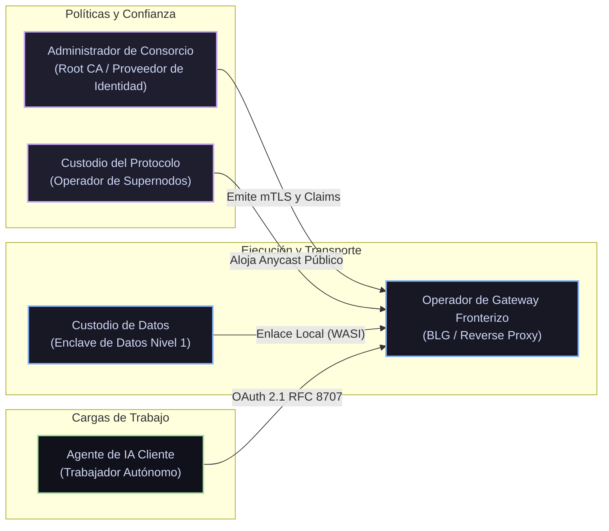
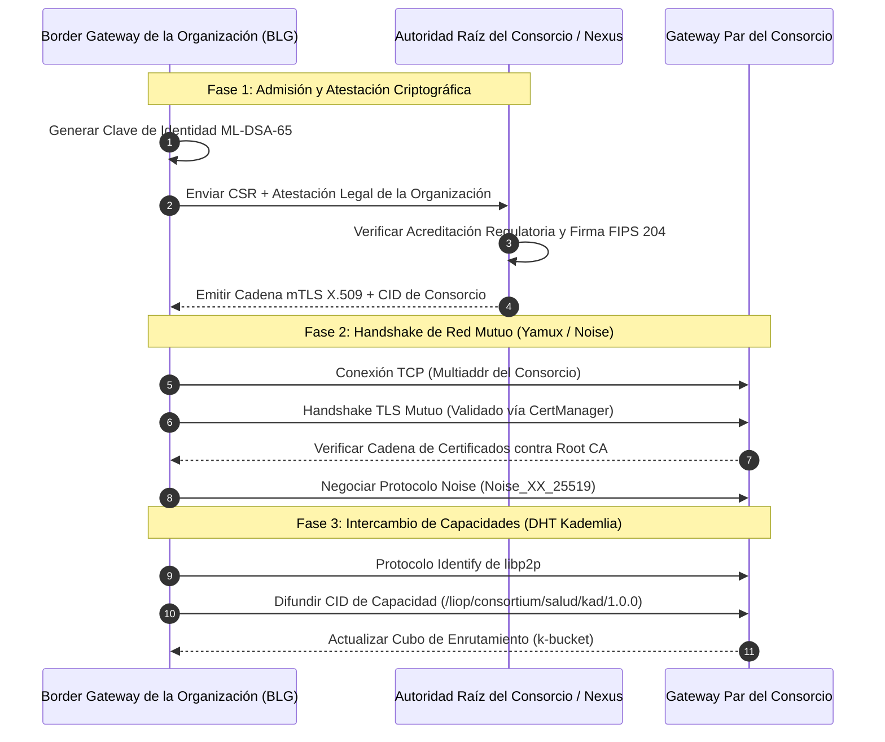
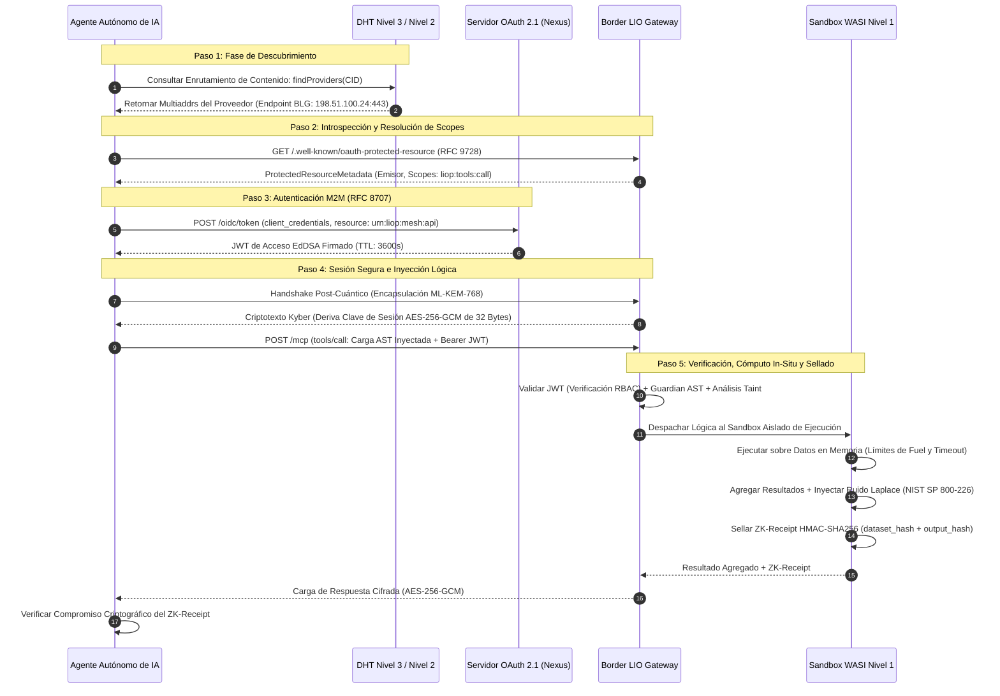
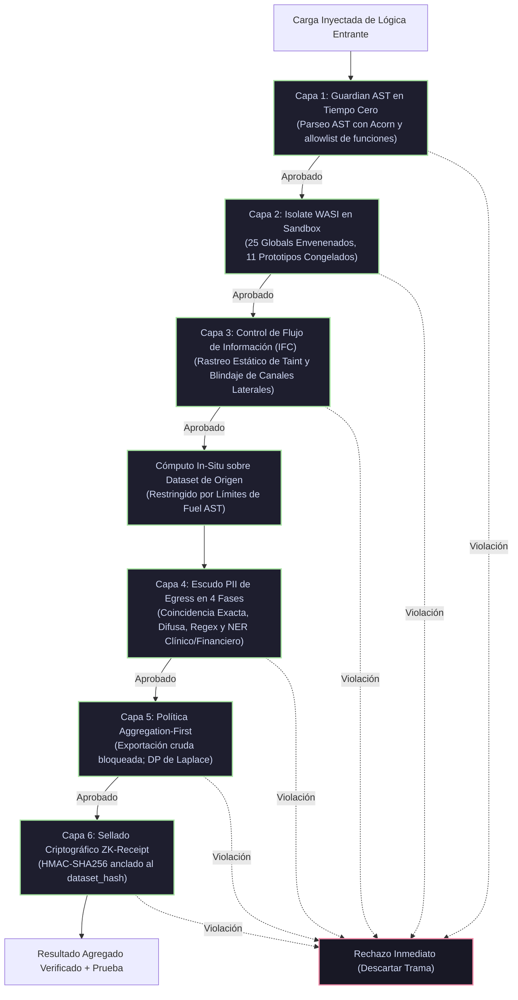

# Protocolo Logic-Injection-on-Origin (LIOP)
# Manual de Operaciones de Malla Soberana: Arquitectura, Identidad, Control de Accesos y Gobernanza de Red

> **Estado del Documento:** Estándar Operativo Normativo Oficial (El Manual de Operaciones Soberano)  
> **Clasificación:** Arquitectura Técnica de Protocolo / Ingeniería de Redes, IAM y Gobernanza Criptográfica  
> **Público Objetivo:** Arquitectos de Sistemas, Ingenieros de Redes, CISOs/CIOs Corporativos, Operadores de Consorcios, Ingenieros de IA  
> **Ratificado Por:** Organización Nekzus Solutions  
> **Primera Ratificación:** Septiembre de 2026 | **Versión del Protocolo:** 2.5+  
> **Licencia:** [CC BY 4.0](https://creativecommons.org/licenses/by/4.0/)  
> **Atribución Requerida:** Cualquier implementación, despliegue o adaptación de estos patrones operativos debe atribuir explícitamente a **Mauricio Ortega (Nekzus)** y **Nekzus Solutions**, e incluir un enlace oficial al repositorio de LIOP.

---

## Índice de Contenidos
1. [Fundamentos Ejecutivos y Post-Mortem Histórico: Lecciones de Internet y Blockchain](#1-fundamentos-ejecutivos-y-post-mortem-histórico-lecciones-de-internet-y-blockchain)
2. [Actores del Ecosistema, Personas y Roles Operativos](#2-actores-del-ecosistema-personas-y-roles-operativos)
3. [Protocolos de Onboarding Extremo a Extremo por Nivel de Red](#3-protocolos-de-onboarding-extremo-a-extremo-por-nivel-de-red)
4. [Arquitectura de Identidad y Autenticación](#4-arquitectura-de-identidad-y-autenticación)
5. [Autorización Granular, RBAC y Gobernanza de Tokens](#5-autorización-granular-rbac-y-gobernanza-de-tokens)
6. [Defensa Perimetral: La Tubería de Inspección de 6 Capas del Border LIO Gateway (BLG)](#6-defensa-perimetral-la-tubería-de-inspección-de-6-capas-del-border-lio-gateway-blg)
7. [Ciclo de Vida Criptográfico, Auditabilidad y Respuesta ante Incidentes](#7-ciclo-de-vida-criptográfico-auditabilidad-y-respuesta-ante-incidentes)
8. [Matriz Arquitectónica Unificada: Internet vs. Blockchain vs. LIOP](#8-matriz-arquitectónica-unificada-internet-vs-blockchain-vs-liop)
9. [Alineación con la Implementación y Roadmap Técnico Planificado](#9-alineación-con-la-implementación-y-roadmap-técnico-planificado)

---

## 1. Fundamentos Ejecutivos y Post-Mortem Histórico: Lecciones de Internet y Blockchain

El diseño de redes distribuidas a escala planetaria ha oscilado históricamente entre dos extremos: estructuras jerárquicas centralizadas plagadas de fragilidad sistémica, y modelos planos sin permisos lastrados por graves cuellos de botella de rendimiento y ausencia de soberanía legal.

LIOP fue diseñado a partir de una autopsia forense de las fallas de diseño fundamentales y los aciertos estructurales tanto de la arquitectura tradicional de Internet (ARPANET/TCP/IP/BGP/DNS) como de las máquinas de estado descentralizadas de los sistemas blockchain modernos (Bitcoin, Ethereum DevP2P, Rollups de Capa 2).

```
┌─────────────────────────────────────────────────────────────────────────┐
│                      EVOLUCIÓN HISTÓRICA DE LAS REDES                   │
├──────────────────────────┬──────────────────────────┬───────────────────┤
│    INTERNET TRADICIONAL  │ REDES DE ESTADO BLOCKCHAIN│    MALLA LIOP    │
│   (BGP / DNS / Texto)    │(Consenso / Transparente) │(Logic-on-Origin)  │
├──────────────────────────┼──────────────────────────┼───────────────────┤
│ • Confianza Implícita(BGP)│ • Cero Confianza, Caro   │ • Zero-Trust M2M  │
│ • Extracción Datos (HTTP)│ • Estado Global Redundante│ • Cómputo In-Situ │
│ • CA Jerárquica Única    │ • DIDs Pseudo-Anónimos   │ • PQC Soberano    │
│ • Metadatos en Claro     │ • Churn Alto P2P / PoW   │ • Enclave Tri-Tier│
└──────────────────────────┴──────────────────────────┴───────────────────┘
```

### 1.1 La Internet Clásica: El Costo de la Seguridad Añadida a Posteriori

Internet nació en un entorno académico y de defensa militar caracterizado por una alta confianza institucional. Esta presunción operativa generó pasivos arquitectónicos que demandan cientos de miles de millones de dólares anuales en mitigaciones:

1. **Border Gateway Protocol (BGP-4) y la Falacia de la Confianza Implícita:**
   - *El Defecto:* BGP se diseñó sin pruebas criptográficas de autorización de rutas. Los routers confían ciegamente en los anuncios de enrutamiento emitidos por los Sistemas Autónomos (AS) vecinos.
   - *La Falla:* El secuestro de rutas (route hijacking), la falsificación de AS-PATH y las fugas accidentales de prefijos redirigen cotidianamente tráfico financiero, gubernamental y civil a través de infraestructuras hostiles. La incorporación tardía de **RPKI (Resource Public Key Infrastructure)** y **ROV (Route Origin Validation)** ha tardado más de tres décadas y aún enfrenta una adopción fragmentada.
   - *La Solución LIOP:* LIOP implementa **Enrutamiento Criptográfico con Identidad Primero (Identity-First)**. Ninguna ruta o capacidad se acepta jamás por mera adyacencia topológica. Cada anuncio en la Tabla Hash Distribuida (DHT) Kademlia exige atestación criptográfica mediante firmas digitales **ML-DSA-65 (FIPS 204)** e identidades Ed25519 PeerID. Los descriptores de capacidad no firmados o inválidos se descartan a nivel de trama antes de su procesamiento.

2. **La Trampa del "Eslabón Más Débil" de la Infraestructura de Clave Pública (PKI):**
   - *El Defecto:* La Web PKI tradicional delega la emisión de certificados en cientos de Autoridades Certificadoras (CAs) comerciales incrustadas en los sistemas operativos. Si una sola CA se ve comprometida (ej. DigiNotar, Comodo, DarkMatter), se pueden emitir certificados fraudulentos para cualquier dominio del planeta.
   - *La Falla:* La PKI jerárquica web es frágil y vulnerable a la coacción de estados nacionales. Los intentos de "certificate pinning" provocaron caídas masivas de servicios cuando las claves rotaban.
   - *La Solución LIOP:* LIOP desacopla totalmente la integridad de la red de las CAs públicas comerciales. En las federaciones de Nivel 2, la identidad se establece mediante **anclas raíz de consorcio fijadas (pinned root anchors)** evaluadas por instancias locales de `CertManager` con recarga en caliente automática. En el Nivel 3, la identidad se deriva matemáticamente de la clave pública del par (direcciones auto-certificadas), impidiendo la subversión por CAs de terceros.

3. **Domain Name System (DNS) y Metadatos Sin Cifrar:**
   - *El Defecto:* DNS se concibió sobre UDP en texto plano. Incluso con DNSSEC, las consultas de resolución difunden las intenciones de usuarios y agentes a través de segmentos de red locales y proveedores de tránsito.
   - *La Falla:* Envenenamiento de caché, secuestro de DNS y vigilancia masiva de metadatos.
   - *La Solución LIOP:* El direccionamiento en LIOP utiliza **Multiaddresses (`multiaddr`)** de libp2p e **Identificadores de Contenido (CIDs)** resueltos directamente a través de transportes cifrados con Noise (`Noise_XX_25519_ChaChaPoly_SHA256`) y Encapsulación Post-Cuántica (`ML-KEM-768`). Ninguna consulta en texto plano viaja jamás por el cable de transporte.

---

### 1.2 Redes Blockchain: El Trilema de Escalabilidad y Privacidad

La tecnología blockchain demostró que la coordinación descentralizada sin autoridades centrales es matemáticamente viable. No obstante, aplicar patrones blockchain ingenuos a operaciones de datos de alto rendimiento y cargas de trabajo de IA genera callejones sin salida arquitectónicos:

1. **La Falacia de la Replicación Global del Estado:**
   - *El Defecto:* Las blockchains exigen que cada nodo completo procese y almacene cada transacción en un libro mayor lineal global.
   - *La Falla:* El consenso planetario estrangula el rendimiento de la red ($15 \text{ a } 2,000 \text{ TPS}$), dispara los costos de cómputo y provoca un crecimiento desmedido del almacenamiento.
   - *La Solución LIOP:* **LIOP no es una blockchain.** LIOP no requiere ningún consenso global sobre transacciones. De acuerdo con el postulado **Logic-Injection-on-Origin (LIO)**, el cómputo se ejecuta exclusivamente en el punto físico de origen (Enclave Nivel 1). Únicamente las agregaciones matemáticas y los **ZK-Receipts** verificables criptográficamente cruzan la frontera de red. La concurrencia escala linealmente $O(N)$ con la adición de nodos de datos independientes sin sufrir el arrastre de sincronización de consenso.

2. **El Dilema de Privacidad de los Libros Mayores Públicos:**
   - *El Defecto:* Los datos escritos en una blockchain pública o clúster IPFS son inmutables y de acceso público. Incluso con rollups de conocimiento cero, los metadatos, frecuencias de acceso y volúmenes transaccionales quedan grabados para siempre.
   - *La Falla:* Incompatibilidad regulatoria frontal con el **RGPD (Artículo 17 "Derecho al Olvido", Artículo 44 "Transferencias Internacionales de Datos")** y la **Regla de Seguridad de HIPAA (§ 164.312)**. Los datos bancarios o médicos confidenciales no pueden residir legalmente en una máquina de estado pública replicada.
   - *La Solución LIOP:* **Invariante de Datos en Reposo.** Los registros propietarios jamás abandonan su base de datos de origen. Ningún libro mayor distribuido alberga historiales clínicos, saldos bancarios ni secretos comerciales. El sandbox de cómputo se ejecuta efímeramente dentro del enclave de origen y purga la memoria tras su ejecución.

3. **Lecciones de Descubrimiento P2P en DevP2P (Ethereum Discv4 vs. Discv5):**
   - *El Acierto:* Ethereum demostró que el descubrimiento entre pares sobre Kademlia requiere señalización explícita de capacidades (Node Records / ENR en Discv5) para evitar conectarse a nodos incompatibles antes de completar costosos handshakes criptográficos.
   - *La Solución LIOP:* LIOP adopta exactamente este modelo. Las capacidades de los nodos se empaquetan como **Manifiestos Firmados** que contienen esquemas de herramientas, scopes OAuth requeridos, firmas post-cuánticas y clasificaciones taxonómicas, difundidos mediante enrutamiento de contenido de Kademlia (`contentRouting.provide`). Los gateways remotos inspeccionan las capacidades antes de iniciar sesiones de transporte gRPC.

---

## 2. Actores del Ecosistema, Personas y Roles Operativos

La operación de una malla soberana federada requiere una separación estricta de responsabilidades entre cinco roles operativos definidos.



### 2.1 Taxonomía Detallada de Roles

| Identificador de Rol | Frontera Operativa | Activos Criptográficos Primarios | Responsabilidad Central |
|---|---|---|---|
| **Custodio de Datos** | Nivel 1 (Enclave Intra-Organizacional) | Credenciales de DB, Clave Maestra KMS local, Secreto HMAC | Propietario de bases de datos físicas. Acopla el `WasiSandbox` local a las tablas. Congela globales, aplica control de fuel y sella ZK-Receipts. |
| **Administrador de Consorcio** | Nivel 2 (Federación Sectorial) | Clave Privada Root CA del Consorcio, Clave de Firma OIDC (Ed25519) | Gobierna la admisión a mallas sectoriales. Emite credenciales de cliente, rota certificados federados y revoca miembros comprometidos. |
| **Operador de Gateway Fronterizo (BLGO)** | Frontera DMZ (Nivel 2/3 $\leftrightarrow$ Nivel 1) | Certificados de Servidor TLS, Clave de Desencapsulación ML-KEM-768, Clave ML-DSA-65 | Administra el Border LIO Gateway con doble interfaz de red. Ejecuta el análisis sintáctico Guardian AST, Taint Tracking, rate-limiting WAF y enrutamiento gRPC. |
| **Agente de IA Cliente** | WAN Externa / Clúster Empresarial | Secreto de Cliente OAuth 2.1 / Keypair, Clave Efímera ML-KEM-768 | Envía lógica computacional a la malla. Consume herramientas vía MCP JSON-RPC y valida ZK-Receipts HMAC-SHA256 con ruido de Privacidad Diferencial. |
| **Custodio del Protocolo** | Nivel 3 (Dorsal Pública de Descubrimiento) | Claves de Peering BGP Anycast, PeerIDs de Semillas | Mantiene supernodos semilla distribuidos geográficamente en Nivel 3. Facilita el descubrimiento de CIDs públicos y conectividad WAN sin inspeccionar tráfico privado. |

---

## 3. Protocolos de Onboarding Extremo a Extremo por Nivel de Red

La incorporación de nodos y agentes a la malla LIOP sigue máquinas de estado deterministas diseñadas para cada nivel arquitectónico.

### 3.1 Onboarding en Nivel 1: Enclave Soberano Intra-Organizacional

El Nodo de Datos de Nivel 1 constituye el núcleo protegido. Jamás se expone a interfaces de red públicas y opera bajo principios estrictos de Zero-Trust.

```
┌────────────────────────────────────────────────────────────────────────┐
│                   APROVISIONAMIENTO DE NODO DE NIVEL 1                 │
├────────────────────────────────────────────────────────────────────────┤
│ Paso 1: Enlace Físico de Datos (Conexión de Solo Lectura a DB Local)   │
│ Paso 2: Instanciación de WasiSandbox (Envenenar 25 Globals, Congelar)   │
│ Paso 3: Registro de Herramientas de Inyección Lógica con Esquemas Zod   │
│ Paso 4: Vinculación a Subred Privada Local (10.0.0.0/8 o Loopback)     │
│ Paso 5: Desactivar WAN Pública y Multicast (enableWAN: false, mDNS: off)│
│ Paso 6: Asociación P2P con el Border LIO Gateway Local vía Multiaddr   │
└────────────────────────────────────────────────────────────────────────┘
```

#### Implementación de Producción de Nodo Nivel 1 (`enclave-node.ts`):
```typescript
import { LiopServer } from "@nekzus/liop";
import { z } from "zod";

// Inicializar nodo de datos dentro del perímetro soberano
const enclaveServer = new LiopServer({
  name: "enclave-oncologia-datos",
  version: "2.5.0",
  auth: { role: "none" }, // La autenticación se delega al Border Gateway perimetral
});

// Vincular snapshot de datos en memoria al isolate WASI (Los datos nunca salen del proceso)
enclaveServer.setSandboxData([
  { id: "PAC-001", edad: 58, biomarcador: "EGFR_MUT", tasaRespuesta: 0.84 },
  { id: "PAC-002", edad: 62, biomarcador: "KRAS_WT", tasaRespuesta: 0.12 },
]);

// Exponer herramienta de procesamiento Logic-on-Origin
enclaveServer.tool(
  "Analizar_Eficacia_Biomarcadores",
  "Ejecuta análisis de varianza estadística sobre cohorte clínica",
  { biomarcadorObjetivo: z.string() },
  async (args: { biomarcadorObjetivo: string }) => {
    // La ejecución ocurre estrictamente in-situ dentro del Isolate V8
    return {
      content: [{ type: "text", text: "Procesamiento de cohorte completado." }],
    };
  }
);

// Conectar estrictamente a la interfaz de red interna
await enclaveServer.connectToMesh({
  port: 50051,
  meshConfig: {
    listenAddresses: ["/ip4/10.0.1.50/tcp/50051"],
    bootstrapNodes: [
      "/ip4/10.0.1.10/tcp/4000/p2p/12D3KooWInternalGatewayRootIdAnchor",
    ],
    enableWAN: false,
    enableMdns: false, // Impedir fugas de broadcast multicast entre VLANs
  },
});

console.log("[Enclave] Nodo de Datos Nivel 1 activo en IP interna 10.0.1.50:50051");
```

---

### 3.2 Onboarding en Nivel 2: Peering en Consorcio Federado Sectorial

Las organizaciones que se incorporan a un consorcio federado (ej. Red Global de Ensayos Clínicos, Prevención de Fraude Interbancario SWIFT) deben completar una atestación mutua antes de participar en la DHT Kademlia del consorcio.



#### Implementación de Producción de Gateway Nivel 2 (`consortium-gateway.ts`):
```typescript
import { LiopServer, LiopHybridGateway, MeshNode } from "@nekzus/liop";
import { CertManager } from "@nekzus/liop/security";

// 1. Inicializar Certificate Manager para monitoreo y recarga en caliente de mTLS
const certManager = new CertManager({
  rootCertPath: "/etc/liop/certs/consortium-root-ca.pem",
  certChainPath: "/etc/liop/certs/hospital-blg-chain.pem",
  privateKeyPath: "/etc/liop/certs/hospital-blg-key.pem",
  warningDays: 30,
  watchFiles: true,
});

// Validar certificados locales al arrancar
const certStatus = certManager.inspectCertificate();
if (certStatus.isExpired) {
  throw new Error(`[BLG-Init] Certificado expirado el ${certStatus.validTo}`);
}

// 2. Configurar MeshNode multi-homed para enrutamiento Kademlia de consorcio
const mesh = new MeshNode({
  listenAddresses: [
    "/ip4/198.51.100.24/tcp/14001",
    "/ip4/198.51.100.24/tcp/14002/ws",
  ],
  bootstrapNodes: [
    "/dns4/consortium-seed-1.health-mesh.org/tcp/14001/p2p/12D3KooWSeedAlpha",
    "/dns4/consortium-seed-2.health-mesh.org/tcp/14001/p2p/12D3KooWSeedBeta",
  ],
  enableWAN: true,
  enableAutoNAT: true,
  enableRelay: true,
  enableDcutr: true,
});

await mesh.start();

// Anunciar CID de capacidad acotado estrictamente al descubrimiento del consorcio
await mesh.announceCapability("Analizar_Eficacia_Biomarcadores");

// 3. Instanciar Border Gateway que enruta al Nodo de Datos interno Nivel 1
const gatewayServer = new LiopServer({
  name: "gateway-fronterizo-hospital",
  version: "2.5.0",
  auth: {
    role: "node",
    issuer: "https://auth.health-consortium.org/oidc",
    audience: "urn:liop:consortium:health",
  },
});

const gateway = new LiopHybridGateway(gatewayServer, mesh, 50051);
await gateway.listen(443, "0.0.0.0");
console.log("[Consorcio] BLG activo en puerto 443 con mTLS y OAuth 2.1 RFC 8707");
```

---

### 3.3 Onboarding en Nivel 3: Dorsal Pública Global de Descubrimiento

La dorsal de Nivel 3 proporciona descubribilidad mundial para datasets abiertos, herramientas de APIs públicas, oráculos de mercado y gateways perimetrales.

```
┌────────────────────────────────────────────────────────────────────────┐
│                   PUBLICACIÓN EN DORSAL GLOBAL NIVEL 3                 │
├────────────────────────────────────────────────────────────────────────┤
│ • Supernodos Semilla Anycast BGP distribuidos en 3 continentes:        │
│     - US-East (Virginia)     : seed-us.liop.network                    │
│     - EU-Central (Frankfurt) : seed-eu.liop.network                    │
│     - AP-Southeast (Singapur): seed-ap.liop.network                    │
│ • Los nodos publican CIDs vía DHT global: /liop/global/kad/2.0.0       │
│ • Los CIDs apuntan a Manifiestos Públicos (Esquemas, Endpoints, Scopes)│
│ • Absolutamente NINGÚN dato sensible ni PII se publica en Nivel 3      │
│ • Los agentes públicos descubren endpoints y negocian sesiones BLG     │
└────────────────────────────────────────────────────────────────────────┘
```

---

### 3.4 Ciclo de Vida del Agente de IA: Del Descubrimiento a la Ejecución

Los agentes autónomos de IA (como Claude Desktop, Cursor o microservicios) consumen servicios en LIOP siguiendo un ciclo de vida estandarizado en 5 pasos:



---

## 4. Arquitectura de Identidad y Autenticación

En LIOP, la identidad es criptográfica, auto-soberana y verificable matemáticamente sin intermediarios centralizados.

### 4.1 Identidad de Nodo: Anclas Criptográficas de Doble Capa

Cada nodo de LIOP opera con dos pares de claves criptográficas independientes:

1. **Identidad de Capa de Transporte (Ed25519):**
   - Formato canónico de identidad entre pares en `libp2p`.
   - El `PeerId` se deriva como el multihash SHA-256 de la clave pública Ed25519 (`12D3KooW...`).
   - Protege el canal de transporte mediante el protocolo Noise (`Noise_XX_25519_ChaChaPoly_SHA256`).

2. **Identidad de Capa de Atestación (ML-DSA-65 Post-Cuántica):**
   - Estándar de firma digital post-cuántica NIST FIPS 204 (Dilithium).
   - Firma criptográficamente el **Manifiesto de Servicio** del nodo (`pqcSignature`).
   - Garantiza que los esquemas de herramientas y los endpoints declarados no puedan ser manipulados por repetidores de transporte intermedios.

---

### 4.2 Identidad de Clientes y Agentes: Perfil M2M OAuth 2.1

LIOP prescinde totalmente de flujos interactivos humanos (Authorization Code + PKCE) en la capa de protocolo de malla. Máquinas, agentes y daemons interactúan exclusivamente a través de **Client Credentials Grant M2M** endurecido bajo **RFC 8707** y **RFC 9068**.

#### Perfil Obligatorio de Claims en el JWT:
```json
{
  "iss": "http://10.0.1.10:3000/oidc",
  "sub": "client_id_autonomous_agent_01",
  "aud": "urn:liop:mesh:api",
  "scope": "liop:tools:list liop:tools:call",
  "resource": "urn:liop:mesh:api",
  "exp": 1756857600,
  "iat": 1756854000,
  "jti": "8f3b2a1c-9e4d-4b8a-9213-f6a7d5c8e12b"
}
```

#### Directivas de Seguridad para Tokens de Acceso:
- **Lista Blanca Estricta de Algoritmos:** Únicamente se aceptan firmas `EdDSA` (Ed25519) y `ES256`. Algoritmos RSA legados (`RS256`, `RS384`, `RS512`) y HMAC simétricos (`HS256`) se rechazan en el validador para neutralizar ataques de confusión de algoritmos (OWASP API-A01).
- **Vida Útil Efímera:** El Time-To-Live (TTL) de los tokens está estrictamente acotado a $3,600 \text{ segundos}$ ($1 \text{ hora}$). Los refresh tokens están desactivados para mitigar acumulación de credenciales.
- **Verificación Fail-Closed:** Si la firma del token no es válida, si el emisor no es reconocido o si la audiencia difiere de `urn:liop:mesh:api`, la solicitud es rechazada de inmediato con código JSON-RPC `-32099` (`Authentication Required`).

---

### 4.3 Descubrimiento Automatizado vía Protected Resource Metadata (PRM)

Para eliminar la configuración manual de URLs de autenticación en los clientes, los Border Gateways implementan **RFC 9728 (OAuth 2.0 Protected Resource Metadata)**.

Cuando un agente no autenticado consulta el gateway:
1. El gateway responde HTTP `401 Unauthorized` con la cabecera `WWW-Authenticate` apuntando a `/.well-known/oauth-protected-resource`.
2. El agente consulta `GET /.well-known/oauth-protected-resource` y obtiene el descriptor generado por `prm.ts`:
   ```json
   {
     "resource": "urn:liop:mesh:api",
     "authorization_servers": ["https://auth.health-consortium.org/oidc"],
     "scopes_supported": [
       "liop:tools:list",
       "liop:tools:call",
       "liop:resources:read",
       "liop:schema:read",
       "liop:mesh:query"
     ],
     "bearer_methods_supported": ["header"],
     "resource_documentation": "https://github.com/nekzus/liop"
   }
   ```
3. El agente negocia dinámicamente sus tokens con el Authorization Server indicado antes de reintentar la inyección lógica.

---

### 4.4 Comparativa de Modelos de Identidad

| Vector Arquitectónico | Web PKI de Internet (X.509) | Blockchain (W3C DID / VCs) | Identidad Soberana LIOP |
|---|---|---|---|
| **Raíz de Confianza** | Cientos de CAs Comerciales Públicas | Registro en Smart Contract / Ledger | Atestación Matemática + Root CA de Consorcio |
| **Resistencia Post-Cuántica**| Pobre (Predominan RSA-2048 y ECC P-256) | Migración lenta (secp256k1 en EVM/Bitcoin) | **Nativa ML-DSA-65 y ML-KEM-768 (FIPS 203/204)** |
| **Modelo de Revocación** | CRL / OCSP (Alta tasa de falla, soft-fail) | Registros on-chain (Costos en gas) | **TRL en Hash-Chain + Recarga de CertManager** |
| **Latencia de Resolución** | Rápida (DNS + OCSP en caché) | Lenta ($2 \text{ a } 60 \text{ segundos}$ en bloque) | **Validación In-Memory en Tiempo Cero ($< 1 \text{ ms}$)** |

---

## 5. Autorización Granular, RBAC y Gobernanza de Tokens

La autenticación comprueba *quién* es una entidad. La autorización gobierna *qué* cálculos tiene permitido ejecutar.

### 5.1 Jerarquía de Scopes de LIOP

LIOP mapea los métodos JSON-RPC / MCP a scopes OAuth específicos. Siguiendo **NIST SP 800-207 §4.3 (Menor Privilegio)**, los permisos se validan de forma determinista antes de parsear la carga lógica o ejecutar el AST.

```
┌─────────────────────────────────────────────────────────────────────────┐
│                        MAPEO DE SCOPES RBAC EN LIOP                     │
├──────────────────────────┬──────────────────────┬───────────────────────┤
│ Método MCP               │ Scope LIOP Requerido │ Nivel de Acceso       │
├──────────────────────────┼──────────────────────┼───────────────────────┤
│ initialize               │ Ninguno (Público)    │ Handshake de Protocolo│
│ ping                     │ Ninguno (Público)    │ Sondeo de Estado      │
│ notifications/*          │ Ninguno (Público)    │ Notificación de Estado│
│ tools/list               │ liop:tools:list      │ Descubrimiento        │
│ tools/call               │ liop:tools:call      │ Inyección Lógica Core │
│ resources/list           │ liop:resources:read  │ Lectura de Esquemas   │
│ resources/read           │ liop:resources:read  │ Lectura de Manifiestos│
│ prompts/list             │ liop:schema:read     │ Inspección de Plantillas│
│ prompts/get              │ liop:schema:read     │ Descarga de Plantillas│
│ * (Método Desconocido)   │ DENEGADO (Fail-Closed)│ Bloqueado por Defecto │
└──────────────────────────┴──────────────────────┴───────────────────────┘
```

---

### 5.2 Lógica Determinista de Decisión (`authorizeRequest`)

El motor RBAC aplica un árbol de decisión estricto en 4 etapas:

```typescript
// Lógica de decisión formal en sdks/typescript/src/security/rbac.ts
export function authorizeRequest(
  method: string,
  auth: AuthInfo | null,
  additionalScopes?: readonly string[]
): AuthorizationResult {
  const methodScopes = SCOPE_MAP[method];

  // 1. Endpoints públicos explícitos pasan incondicionalmente
  if (methodScopes !== undefined && methodScopes.length === 0) {
    return { allowed: true };
  }

  // 2. Endpoints protegidos sin contexto de autenticación fallan de inmediato
  if (!auth) {
    return {
      allowed: false,
      reason: `Autenticación requerida para el método: ${method}`,
    };
  }

  // 3. Fusionar scopes del método con scopes restringidos del nodo
  const needed = [...(methodScopes ?? []), ...(additionalScopes ?? [])];

  // 4. Métodos no mapeados fallan de forma cerrada per NIST SP 800-207
  if (needed.length === 0) {
    return {
      allowed: false,
      reason: `Método desconocido: ${method}. Acceso denegado (fail-closed).`,
    };
  }

  // 5. Comprobar que todos los scopes requeridos figuren en el JWT
  const clientScopes = new Set(auth.scopes);
  const missing = needed.filter((s) => !clientScopes.has(s));

  if (missing.length > 0) {
    return {
      allowed: false,
      reason: `Scopes insuficientes para ${method}. Faltantes: ${missing.join(", ")}`,
    };
  }

  return { allowed: true };
}
```

---

### 5.3 Aliasing de Autoridades y Traspaso de NAT en Docker

En entornos virtualizados de Kubernetes o Docker, los servidores de autorización responden bajo diferentes nombres de host según la perspectiva de red:
- *Red interna de contenedores:* `http://nexus:3000`
- *Puerto publicado en el host:* `http://127.0.0.1:13000`
- *Ingress de malla de servicios:* `http://liop-nexus:3000`

Las librerías tradicionales de JWT fallan si el claim `iss` no coincide de forma exacta con la cadena esperada. LIOP resuelve esta fricción mediante **Aliasing de Autoridades** en `JwtValidator.buildIssuerAliases()`:
- El validador mapea equivalencias entre loopback, nombres de servicio y puertos publicados.
- La firma criptográfica se verifica con rigor inalterado contra las claves públicas del JWKS. Únicamente se relaja la comparación de cadenas del host del emisor entre alias autorizados, previniendo falsos positivos de autenticación en fronteras de contenedores.

---

### 5.4 Listas de Revocación de Tokens (TRL)

Cuando se detecta una clave de cliente vulnerada o un proceso desbocado, los tokens deben poder revocarse antes de que expire su ventana de 1 hora.

- **Lista de Revocación de Tokens (TRL):**
  - Los gateways mantienen un hash set en memoria de tokens revocados indexados por su resumen criptográfico: `SHA256(raw_jwt)`.
  - La verificación de revocación es una búsqueda $O(1)$ en memoria que toma $< 5 \text{ microsegundos}$.
  - La TRL se persiste localmente en un registro JSON (`revocationPath`) y se sincroniza entre miembros del consorcio vía pub/sub de libp2p.

---

### 5.5 Limitación de Tasa Multicapa (Defensa Anti-DoS)

Para mitigar ataques de denegación de servicio o bucles recursivos en agentes autónomos, los gateways implementan limitación de tasa por cubos de tokens (token-bucket):
- **Ventana de Evaluación:** Ventana deslizante de 60 segundos con precisión de microsegundos.
- **Agrupación de Clientes:** Indexado por `clientId` autenticado (o IP remota en descubrimientos públicos).
- **Respuesta ante Excesos:** Superar los umbrales retorna HTTP `429 Too Many Requests` con la cabecera estándar `Retry-After: <segundos>`.

---

## 6. Defensa Perimetral: La Tubería de Inspección de 6 Capas del Border LIO Gateway (BLG)

El **Border LIO Gateway (BLG)** impone una política de asimetría absoluta:
- **Entrada (Ingress):** El código entra *únicamente* si se demuestra estáticamente seguro.
- **Salida (Egress):** Los datos crudos *jamás* salen. Solo egresan agregaciones matemáticas con pruebas criptográficas.



### 6.1 Especificación Detallada de las Capas de Seguridad

1. **Capa 1: Guardian AST en Tiempo Cero (Portero Pre-Ejecución):**
   - Parsea la cadena de código entrante a un Árbol de Sintaxis Abstracta (AST) con Acorn configurando `{ allowReturnOutsideFunction: true }`.
   - Valida todas las invocaciones contra una lista blanca estricta de 14 símbolos: `Math.abs`, `Math.min`, `Math.max`, `Math.round`, `Math.floor`, `Math.ceil`, `Math.sqrt`, `Math.pow`, `Array.prototype.map`, `filter`, `reduce`, `find`, `length`, y `JSON.stringify`.
   - Bloquea cualquier evaluación dinámica (`eval`, `Function`, `setTimeout`, `setInterval`).

2. **Capa 2: Sandbox WASI y Congelamiento de Prototipos:**
   - Desplegado dentro de un Isolate V8 dedicado o entorno Wasmtime.
   - Envenena activamente 25 variables globales del entorno anfitrión (`process`, `require`, `fs`, `net`, `http`, `child_process`, `globalThis`, etc.).
   - Congela previamente 11 prototipos centrales de JavaScript mediante `Object.freeze()` para neutralizar ataques de Prototype Pollution (CWE-915).
   - Aplica medición determinista de fuel: el cómputo se aborta si el fuel se agota.

3. **Capa 3: Control de Flujo de Información (IFC) y Rastreo de Taint:**
   - Analiza el AST en busca de patrones de extracción por canales laterales explícitos o implícitos.
   - Detecta ataques de derivación carácter por carácter (ej. `str.charCodeAt(0) > 65 ? true : false`) concebidos para fugar cadenas confidenciales a través de respuestas booleanas.

4. **Capa 4: Escudo PII de Salida en 4 Fases:**
   - Evalúa cada candidato de salida a través de cuatro filtros consecutivos:
     1. *Coincidencia Exacta de Claves:* Identifica nombres de campos confidenciales (`ssn`, `iban`, `credit_card`, `password`).
     2. *Coincidencia Difusa de Claves:* Detecta variaciones ofuscadas (`c_card`, `s-s-n`, `pass_wrd`).
     3. *Escaneo por Expresiones Regulares:* Verifica patrones validados por Luhn (tarjetas de crédito), formatos SSN e IBAN.
     4. *Reconocimiento de Entidades Nombradas (NER):* Detecta nombres de personas, direcciones físicas y diagnósticos clínicos.

5. **Capa 5: Política Aggregation-First y Privacidad Diferencial:**
   - Exige que los datos retornados constituyan una reducción matemática ($N \to 1$ o $N \to M$ donde $M \ll N$).
   - Rechaza consultas que intenten retornar colecciones crudas de registros de la base de datos.
   - Inyecta ruido de Laplace matemáticamente delimitado ($\epsilon, \delta$) siguiendo las directrices **NIST SP 800-226** para garantizar privacidad diferencial.

6. **Capa 6: Sellado Criptográfico ZK-Receipt:**
   - Deriva un recibo criptográfico determinista que vincula:
     $$\text{Recibo} = \text{HMAC-SHA256}_{K_{\text{sesión}}}\left(\text{dataset\_hash} \parallel \text{logic\_hash} \parallel \text{output\_hash}\right)$$
   - El cliente o agente verifica este recibo contra el secreto de sesión post-cuántico compartido, probando matemáticamente que el cómputo se ejecutó sobre el dataset genuino e inmutable de origen sin haber tenido acceso visual directo a los registros.

---

## 7. Ciclo de Vida Criptográfico, Auditabilidad y Respuesta ante Incidentes

La seguridad criptográfica es perecedera. Claves, certificados y nodos deben someterse a una gestión de ciclo de vida automatizada.

### 7.1 Ciclo de Vida de Claves y Sesiones

| Primitiva Criptográfica | Algoritmo / Estándar | Vida Útil / TTL | Mecanismo de Rotación |
|---|---|---|---|
| **Cifrado de Sesión PQC** | ML-KEM-768 (FIPS 203) + AES-256-GCM | 1 Hora ($3,600 \text{ s}$) | Re-negociación silenciosa automática sobre flujo Yamux existente |
| **Atestación de Nodo** | ML-DSA-65 (FIPS 204) | 1 Año | Re-certificación fuera de línea con actualización de Manifiesto Génesis |
| **Tokens de Acceso M2M** | Ed25519 (EdDSA) JWT | 1 Hora ($3,600 \text{ s}$) | Generación efímera vía endpoint de tokens OAuth 2.1 |
| **Certificados mTLS Consorcio**| X.509 (ECDSA P-256 / Ed25519) | 90 Días | Recarga en caliente no disruptiva vía `CertManager` |

---

### 7.2 Recarga en Caliente No Disruptiva de mTLS (`CertManager`)

En consorcios de alta disponibilidad, reiniciar nodos para rotar certificados TLS interrumpe flujos de trabajo activos y degrada la red.

`CertManager` supervisa los archivos de certificados mediante observadores del sistema de archivos no bloqueantes (`fs.watch`) con filtrado de rebote (debounce):
1. Cuando agentes de certificados (ej. Certbot, Vault, Smallstep) escriben nuevos archivos `.pem`, `CertManager` carga los buffers renovados.
2. Valida la nueva cadena mediante la API nativa de Node.js `crypto.X509Certificate`.
3. Actualiza los contextos SSL en memoria y emite el evento `reload`.
4. Los flujos gRPC en curso continúan sin interrupciones; las nuevas conexiones entrantes adoptan inmediatamente los certificados renovados.

---

### 7.3 Registro Inmutable de Auditoría: Cumplimiento SOC 2 Tipo II e HIPAA

Cada invocación de Logic-on-Origin debe generar una traza de auditoría infalsificable. LIOP implementa una **Cadena Hash Criptográfica de Solo Adición** (`audit-logger.ts`):

$$\text{EntryHash}_i = \text{SHA256}\left(\text{Entry}_i \parallel \text{EntryHash}_{i-1}\right)$$

```json
{
  "id": "e4b1c7a2-9d3f-4e8b-b1a6-7c2d5e8f9a0b",
  "timestamp": "2026-09-02T19:30:00.000Z",
  "traceId": "a1b2c3d4e5f60718293a4b5c6d7e8f90",
  "agentDid": "agent:client_id_autonomous_agent_01",
  "peerId": "12D3KooWBankNodeMainnetAlpha",
  "toolName": "Analizar_Eficacia_Biomarcadores",
  "datasetHash": "e3b0c44298fc1c149afbf4c8996fb92427ae41e4649b934ca495991b7852b855",
  "fuelConsumed": 1420,
  "outputHash": "7d8f9a0b1c2d3e4f5a6b7c8d9e0f1a2b3c4d5e6f7a8b9c0d1e2f3a4b5c6d7e8f",
  "zkReceiptSig": "AQEQIAAAAAEBAQEBAQ...",
  "status": "SUCCESS",
  "prevEntryHash": "0000000000000000000000000000000000000000000000000000000000000000",
  "entryHash": "5a4b3c2d1e0f9a8b7c6d5e4f3a2b1c0d9e8f7a6b5c4d3e2f1a0b9c8d7e6f5a4b"
}
```

Si un atacante modifica un registro histórico, la cadena hash se rompe y el método `verifyIntegrity()` señala el índice exacto comprometido, garantizando no repudio en auditorías forenses.

---

### 7.4 Protocolo de Respuesta ante Nodos Comprometidos

Ante la vulneración física de un host o la filtración de claves:

```
┌────────────────────────────────────────────────────────────────────────┐
│            PROTOCOLO ANTE COMPROMISO DE NODOS EN LA MALLA              │
├────────────────────────────────────────────────────────────────────────┤
│ 1. REVOCAR: El Admin del Consorcio revoca el certificado en la CRL.    │
│ 2. LISTA NEGRA: Difundir el PeerId y clave ML-DSA-65 vía pub/sub TRL.  │
│ 3. EXPULSAR: Los gateways pares cierran flujos Yamux y bloquean la IP. │
│ 4. PURGA DHT: Los supernodos desalojan los CIDs de sus tablas Kademlia.│
│ 5. REGENERAR: El Custodio de Datos destruye claves y recrea su KMS.    │
│ 6. AUDITAR: Ejecutar verifyIntegrity() sobre el AuditLogger local.     │
└────────────────────────────────────────────────────────────────────────┘
```

---

## 8. Matriz Arquitectónica Unificada: Internet vs. Blockchain vs. LIOP

Esta tabla comparativa sintetiza cómo LIOP absorbe los principios sólidos de la ingeniería de Internet junto a las garantías matemáticas de los sistemas descentralizados:

| Vector Arquitectónico | Internet Tradicional (HTTP / BGP / Web PKI) | Blockchain Pública (Ethereum / Rollups) | Malla Soberana (Arquitectura Tri-Tier LIOP) |
|---|---|---|---|
| **Paradigma Fundamental**| Context-Pulling (Datos extraídos al cliente) | Máquina de Estado Distribuida (Replicación Global)| **Logic-Injection-on-Origin (Cómputo hacia los datos)** |
| **Modelo de Confianza** | Confianza Implícita (Perímetros expuestos a BGP)| Sin Confianza (Sobrecarga severa de consenso) | **Zero-Trust (NIST SP 800-207, verificación continua)** |
| **Escalabilidad** | Alto ancho de banda, $O(N)$ transferencia | Cuello de botella ($15 - 2,000 \text{ TPS}$) | **Escala Horizontal Ilimitada $O(1)$ transferencia constante** |
| **Postura Post-Cuántica**| Vulnerable (Amenaza "Cosechar hoy, descifrar mañana")| Vulnerable (Claves clásicas ECDSA secp256k1)| **Nativa ML-KEM-768 (Kyber) y ML-DSA-65 (Dilithium)** |
| **Cumplimiento Legal** | Pobre (Exportaciones sancionadas por RGPD/HIPAA)| Imposible (Registros públicos violan Derecho al Olvido)| **Nativo (Datos en reposo; solo egresan agregaciones ZK)** |
| **Identidad y Rutas** | Direcciones IP + DNS en claro | Direcciones de billeteras pseudo-anónimas | **Ed25519 PeerIDs + Multiaddrs + CIDs de Contenido** |
| **Control de Accesos** | Fragmentado (API keys, cookies de sesión) | Modificadores de función en smart contracts | **Tokens M2M OAuth 2.1 RFC 8707 + Scopes RBAC Finos** |
| **Garantías de Integridad**| Ninguna (Confianza en TLS efímero de tránsito) | Consenso criptográfico (Bloques y Merkle Trees) | **ZK-Receipts (HMAC-SHA256 anclado a dataset_hash)** |

---

## 9. Alineación con la Implementación y Roadmap Técnico Planificado

### 9.1 Estado Auditado en `@nekzus/liop@2.5.0`

El paquete oficial `@nekzus/liop@2.5.0` implementa en su totalidad los siguientes módulos criptográficos, de red y de gobernanza:
- ✅ **Motor RBAC:** Autorización por scopes en métodos MCP (`security/rbac.ts`).
- ✅ **Validador de Tokens JWT:** Resolución dual JWKS con aliasing de autoridades (`security/jwt-validator.ts`).
- ✅ **Servidor OAuth 2.1 Embebido:** Endurecido para Client Credentials M2M (`security/oauth-server.ts`).
- ✅ **Metadatos de Recursos Protegidos (PRM):** Endpoint de descubrimiento RFC 9728 (`security/prm.ts`).
- ✅ **Certificate Manager:** Inspección X.509 y recarga en caliente con debounce (`security/cert-manager.ts`).
- ✅ **Audit Logger Inmutable:** Libro mayor con cadena hash SHA-256 (`security/audit-logger.ts`).
- ✅ **Criptografía Post-Cuántica:** Enlaces nativos ML-KEM-768 y ML-DSA-65.
- ✅ **Núcleo de Aislamiento WASI:** Isolate V8 con 25 globales envenenados y 11 prototipos congelados.
- ✅ **Motor ZK-Receipt:** Compromisos HMAC-SHA256 anclados a `dataset_hash`.
- ✅ **Motor de Privacidad Diferencial:** Ruido de Laplace y DDP conforme a NIST SP 800-226.

---

### 9.2 Roadmap Técnico Planificado (Mejoras Futuras del Protocolo)

Para garantizar la máxima transparencia técnica, se documentan formalmente los siguientes hitos de evolución planificados:

1. **Aislamiento Físico con Claves de Enjambre `pnet` (Blindaje Nivel 1):**
   - *Estado Actual:* Los nodos de Nivel 1 se aíslan mediante direccionamiento local (`10.0.0.0/8`), `enableWAN: false` y `enableMdns: false`.
   - *Mejora en Roadmap:* Incorporar soporte nativo para Pre-Shared Keys (`/key/swarm/psk/1.0.0`) de libp2p en `MeshNodeConfig`. Nodos que carezcan de la clave PSK de 256 bits derivada del KMS corporativo serán rechazados a nivel de tramas antes de iniciar el handshake Noise.

2. **Credenciales Verificables W3C (VC) para Gobernanza de Consorcio (Nivel 2):**
   - *Estado Actual:* La pertenencia al consorcio se valida mediante mTLS X.509 y Manifiestos Génesis firmados.
   - *Mejora en Roadmap:* Convertir las acreditaciones del consorcio en Presentaciones Verificables W3C con pruebas de conocimiento cero, permitiendo verificar membresías sin revelar la identidad institucional a repetidores de red.

3. **Atestación Remota de Enclaves Seguros de Hardware (TEE en Nivel 2):**
   - *Estado Actual:* El sandboxing opera por aislamiento de software (Isolates V8 / Wasmtime con globales envenenados).
   - *Mejora en Roadmap:* Anclar el motor de ZK-Receipts a enclaves de hardware (Intel SGX, AMD SEV-SNP, Apple Secure Enclave). El recibo incorporará una cotización de hardware demostrando ejecución en silicio auténtico.

4. **Resolución Planetaria DNS-over-HTTPS (DoH) para Supernodos (Nivel 3):**
   - *Estado Actual:* La resolución de semillas utiliza multiaddrs estándar y registros DNSLink.
   - *Mejora en Roadmap:* Incorporar resolutores de respaldo DNS-over-HTTPS (RFC 8484) directamente en `MeshNode`, garantizando conectividad con los supernodos incluso en redes corporativas restrictivas que bloquean el puerto UDP 53.

---

## 10. Declaración de Cierre

El **Manual de Operaciones de Malla Soberana** consagra la doctrina operativa permanente del protocolo Logic-Injection-on-Origin. Al reemplazar la confianza implícita por verificación matemática continua, sustituir la extracción de datos por cómputo in-situ, y armonizar enclaves corporativos privados con descubrimiento global, LIOP establece el tejido fundacional para la próxima generación de inteligencia artificial soberana a escala planetaria.
