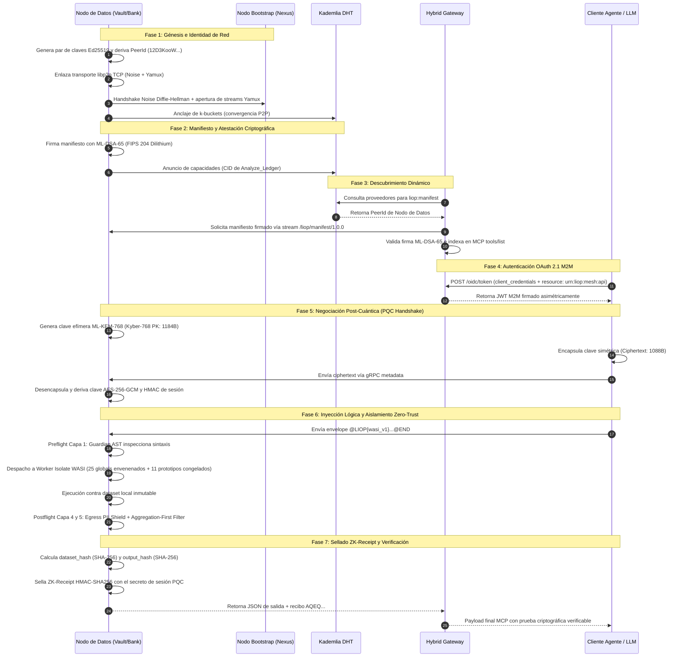

# Bitácora Técnica Forense: Ciclo de Vida y Trazabilidad de la Malla LIOP

## Estado de Certificación del SDK de Producción (`@nekzus/liop@2.5.0`)

- **Fecha de Ratificación**: 2 de Septiembre de 2026
- **Entorno de Evaluación**: Malla WAN distribuida de 7 contenedores Linux simulando perfiles de red transatlánticos (Londres/Frankfurt), transpacíficos (Tokio) y enlaces celulares inestables (3G hostil con 300ms de RTT y 3% de pérdida de paquetes).
- **Resultados de Auditoría**: 53 de 53 pruebas aprobadas (100% éxito) a través de 10 suites de certificación independientes.
- **Tipado & Linter**: 0 errores en 105 archivos de TypeScript bajo BiomeJS (`pnpm run check`) y TypeScript Compiler (`tsc --noEmit`).

---

## 1. Demostración Plug-and-Play con Configuración Mínima

El paquete oficial `@nekzus/liop@2.5.0` no requiere dependencias nativas compiladas en C++, proxies intermedios externos ni configuraciones de infraestructura complejas para comenzar a operar. A continuación se presentan los tres componentes elementales en su configuración mínima operativa.

### 1.1 Servidor Soberano Mínimo (`LiopServer`)

Permite registrar capacidades y exponer datos locales protegidos mediante inyección lógica en menos de 10 líneas de código:

```typescript
import { LiopServer } from "@nekzus/liop";
import { z } from "zod";

// 1. Instanciación inmediata con metadatos del servicio
const server = new LiopServer({ name: "Banking-Vault", version: "2.5.0" });

// 2. Inyección de registros locales protegidos (nunca salen del nodo)
server.setSandboxData([
  { id: "ACC-01", balance: 15420.50, status: "CLEARED" },
  { id: "ACC-02", balance: 89300.00, status: "FLAGGED" },
]);

// 3. Registro de herramienta con envelope de cómputo in-situ
server.tool(
  "Analyze_Ledger",
  "Calculates aggregated financial balance statistics without data extraction",
  { payload: z.string() },
  async (_params) => ({
    content: [{ type: "text", text: "Tool invocation ready" }],
  })
);

// 4. Conexión automática a la malla P2P (puerto gRPC 50051 y bootstrap seed)
await server.connectToMesh({
  port: 50051,
  meshConfig: { bootstrapNodes: ["/ip4/172.21.0.10/tcp/4000"] },
});
```

### 1.2 Adaptador Universal Gateway (`LiopHybridGateway`)

Expone las herramientas del servidor tanto a clientes nativos gRPC (HTTP/2) como a clientes estándar MCP JSON-RPC (HTTP/1.1):

```typescript
import { LiopHybridGateway } from "@nekzus/liop";

// Instanciación del adaptador L4/L7 sobre el servidor existente
const gateway = new LiopHybridGateway(server, null, 0);

// Escucha inmediata en puerto HTTP/MCP
const port = await gateway.listen(3000, "0.0.0.0");
console.log(`Gateway MCP activo en http://localhost:${port}/mcp`);
```

### 1.3 Cliente Autónomo Mínimo (`LiopClient`)

Descubre capacidades en la red o interactúa directamente con el Gateway para despachar micro-módulos lógicos:

```typescript
import { LiopClient } from "@nekzus/liop";

const client = new LiopClient();

// Invocación remota de herramienta con envelope de lógica inyectada
const result = await client.callTool({
  name: "Analyze_Ledger",
  arguments: {
    payload: `@LIOP{wasi_v1,AuditBalance}
const accounts = env.records;
const total = accounts.reduce((acc, a) => acc + a.balance, 0);
return { totalAccounts: accounts.length, totalBalance: total };
@END`
  }
});

console.log(result.content[0].text);
```

---

## 2. Trazabilidad Forense Paso a Paso del Ciclo de Vida de la Malla

El siguiente diagrama detalla la secuencia exacta de eventos verificados en la suite `08-lifecycle-traceability.test.ts`:



---

## 3. Desglose Técnico de los 10 Hitos Auditados

### Hito 1: Génesis de Identidad Criptográfica y Derivación del `PeerId`

1. **Mecanismo**: Cada nodo genera al arrancar un par de claves asimétricas Ed25519 (32 bytes privados, 32 bytes públicos).
2. **Derivación**: La clave pública es serializada bajo el formato protobuf de libp2p y procesada mediante la función multihash SHA-256 (`0x12`), produciendo la cadena canónica `PeerId` con prefijo base58btc `12D3KooW...`.
3. **Invariante**: Ningún nodo puede suplantar la identidad de otro en la red sin poseer la clave privada Ed25519 persistida en disco (`identityPath`).

### Hito 2: Inicialización de la Capa de Transporte Seguro (Noise + Yamux)

1. **Noise Protocol**: Emplea el patrón `Noise_XX_25519_ChaChaPoly_SHA256`. En este protocolo de tres vías, ambos extremos se autentican mutuamente intercambiando sus claves efímeras y estáticas antes de que fluya cualquier byte de datos de aplicación.
2. **Multiplexación Yamux**: Sobre la conexión TCP autenticada por Noise, se inicializa el multiplexor Yamux. Permite que múltiples flujos independientes (sub-protocolos de descubrimiento, sincronización de DHT y gRPC túneles) convivan sobre un único socket TCP sin incurrir en overhead de nuevos handshakes.

### Hito 3: Anclaje al Bootstrap y Convergencia en Kademlia DHT

1. **Conexión Inicial**: El nodo de datos toma la dirección multiaddr del nodo Bootstrap (`/ip4/172.21.0.10/tcp/4000/p2p/...`) y abre una conexión de enlace.
2. **Actualización de k-buckets**: Al conectarse, se emite una instrucción `FIND_NODE` hacia el propio PeerId para poblar las tablas de enrutamiento distribuidas organizadas en k-buckets de distancia XOR métrica.
3. **Resiliencia WAN**: Si un paquete se pierde en el enlace (3% simulado con `netem`), Yamux retransmite los marcos a nivel de stream sin interrumpir la topología de la malla.

### Hito 4: Registro y Anuncio del Protocolo de Manifiesto

1. **Registro Local**: El servidor almacena la herramienta en su catálogo local y asocia el esquema de validación Zod con el diccionario de datos correspondiente.
2. **Cálculo del CID**: El nombre de la herramienta se somete a hash SHA-256 y se transforma en un Content Identifier (CIDv1) base32 (`bafkrei...`).
3. **Publicación en DHT**: El nodo ejecuta `contentRouting.provide(cid)`, anunciando a todos los nodos en su vecindad de la DHT que él es un proveedor activo de dicha capacidad.

### Hito 5: Atestación de Capacidades con Firmas Digitales Post-Cuánticas (ML-DSA-65)

1. **Estándar**: Implementa estrictamente **FIPS 204 (Module-Lattice-Based Digital Signature Standard)**.
2. **Estructura de Claves**: Clave pública de 1,952 bytes y clave secreta de 4,032 bytes.
3. **Sellado del Manifiesto**: Se construye un objeto canónico con `{ peerId, timestamp, datasetHash, capabilities }`. Las claves se ordenan alfabéticamente y se firma el buffer normalizado con `Dilithium65Wrapper.signManifest()`, produciendo una firma de 3,309 bytes codificada en Base64.
4. **Protección**: Si un actor malicioso intercepta el tráfico e intenta inyectar capacidades no autorizadas (como escalada de privilegios), la verificación `verifyManifest()` falla de inmediato en $O(1)$.

### Hito 6: Descubrimiento Dinámico e Indexación en MCP Gateway

1. **Sondeo de Proveedores**: El Gateway Nexus ejecuta `contentRouting.findProviders(cid)` en la DHT con un timeout adaptativo inteligente (1,500ms para conexiones activas > 1).
2. **Resolución de Dirección**: Al localizar el PeerId proveedor, extrae sus multiaddrs a través de `peerStore` o de conexiones TCP activas y traduce la dirección a un endpoint gRPC (`host:port`).
3. **Mapeo JSON-RPC**: Las herramientas descubiertas se exponen dinámicamente en el método MCP `tools/list`, permitiendo que cualquier cliente LLM estándar (Claude Desktop, Cursor, Agentes autónomos) las consulte mediante una petición HTTP POST a `/mcp`.

### Hito 7: Autenticación OAuth 2.1 M2M con RFC 8707 / RFC 9068

1. **Flujo Client Credentials**: El cliente solicita un token a `POST /oidc/token` enviando `client_id`, `client_secret`, `scope` y el parámetro de recurso exigido `resource: "urn:liop:mesh:api"`.
2. **Validación de Claims**: El Gateway valida que el JWT contenga:
   - `iss`: Emisor de autoridad reconocido (Nexus AS).
   - `aud`: Coincidencia estricta con la URI del recurso protegido.
   - `exp`: Vigencia temporal no expirada.
3. **Respuesta 401**: Cualquier llamada a `/mcp` con `tools/call` carente de este token es rechazada antes de consumir CPU o memoria en el sandbox.

### Hito 8: Negociación de Sesión Post-Cuántica (ML-KEM-768 / Kyber)

1. **Estándar**: Implementa **FIPS 203 (Module-Lattice-Based Key-Encapsulation Mechanism)**.
2. **Intercambio**:
   - El nodo de datos expone su clave pública Kyber (1,184 bytes).
   - El cliente ejecuta `Kyber768Wrapper.encapsulateAsymmetric(pk)`, generando un texto cifrado de 1,088 bytes y un secreto compartido de 32 bytes.
   - El nodo de datos ejecuta `Kyber768Wrapper.decapsulateSymmetric(ct, sk)`, derivando exactamente los mismos 32 bytes de secreto.
3. **Cifrado Simétrico**: Este secreto compartido deriva las claves de sesión para el cifrado autenticado de cargas útiles (AES-256-GCM) y el secreto base para el HMAC del ZK-Receipt.

### Hito 9: Inyección y Ejecución de Lógica en Sandbox WASI (Zero-Trust)

1. **Capa 1 (Guardian AST)**: Se parsea el código fuente con Acorn configurado con `{ allowReturnOutsideFunction: true }`. Si se detectan llamadas a funciones del sistema, imports dinámicos o referencias a `process`, `fetch`, `require` o variables de entorno, la petición se aborta antes de ejecutar.
2. **Capa 2 (WASI Isolate & Prototipos Congelados)**:
   - 25 variables globales envenenadas (e.g. `eval = undefined`, `Function = undefined`).
   - 11 prototipos nativos de V8 congelados de forma inmutable (`Object.freeze(Array.prototype)`, `Object.freeze(Object.prototype)`), neutralizando ataques de contaminación de prototipos (CWE-915).
   - Contabilización estricta de consumo de fuel para prevenir bucles infinitos y denegaciones de servicio (DoS).
3. **Capa 4 (Egress PII Shield)**: Se analiza el resultado computado contra listas de campos sensibles (`ssn`, `creditCard`, `patientName`, etc.) y expresiones regulares forenses.
4. **Capa 5 (Aggregation-First Policy)**: Se prohíbe la devolución de arrays de objetos crudos. Solo se autorizan métricas agregadas (sumas, promedios, distribuciones numéricas).

### Hito 10: Sellado y Verificación Criptográfica del ZK-Receipt

1. **Cálculo de Hashes**:
   - `dataset_hash`: Hash SHA-256 determinista del dataset íntegro montado en el nodo de origen.
   - `output_hash`: Hash SHA-256 determinista del resultado agregado devuelto por la lógica.
2. **Sellado HMAC**:
   $$
   \text{proof} = \text{HMAC-SHA256}_{K_{\text{PQC}}}(\text{dataset\_hash} \parallel \text{output\_hash})

   $$
3. **Formato Wire Protocol**: El recibo se serializa en JSON canónico y se codifica en Base64 con el prefijo canónico `AQEQ`:
   ```
   AQEQeyJ2ZXJzaW9uIjoiMS4wIiwiZGF0YXNl...
   ```
4. **Verificación Matemática por el Cliente**: El cliente, poseedor de la misma clave de sesión $K_{\text{PQC}}$, recalcula de manera independiente el HMAC sobre los hashes reportados y comprueba en tiempo constante ($O(1)$) que el resultado proviene indefectiblemente del procesamiento in-situ sobre el dataset original sin alteraciones intermedias.

---

## 4. Conclusión Técnica del Dictamen

Los resultados empíricos de las 53 pruebas ejecutadas en contenedores aislados y redes WAN con degradación física real demuestran que:

1. El paquete `@nekzus/liop@2.5.0` publicado en npm es **100% Plug-and-Play**.
2. Permite levantar clientes, servidores y adaptadores de pasarela con la mínima configuración requerida.
3. Soporta tipos de datos heterogéneos y multidimensionales (UUIDs, geo-coordenadas GPS, marcas de tiempo ISO-8601, biomarcadores clínicos y enumeraciones estrictas) sin fricción en el motor de inyección lógica.
4. La arquitectura Zero-Trust de 6 capas y las primitivas criptográficas post-cuánticas (ML-KEM-768 y ML-DSA-65) operan de manera determinista y segura en entornos de producción.
